# Claude Prompt Engineering Master Guide

**Complete Developer Reference for Building with Claude**

---

## Overview

### What is Prompt Engineering in Claude?

Prompt engineering is the practice of crafting inputs (prompts) to guide Claude's behavior and outputs. It's the most powerful, cost-effective, and fastest way to control model performance—far more efficient than finetuning.

**Why It Matters:**
- **Reliability**: Clear prompts reduce misinterpretation and errors
- **Reasoning**: Structured prompts enable better step-by-step logic
- **Control**: Precise techniques shape tone, format, and accuracy

### Prompting vs. Finetuning

| Factor | Prompt Engineering | Finetuning |
|--------|-------------------|------------|
| **Speed** | Instant results | Hours to days |
| **Cost** | Minimal (text input only) | Expensive (requires GPUs) |
| **Resources** | None required | High-end GPUs, large memory |
| **Data Needs** | Few-shot or zero-shot | Substantial labeled datasets |
| **Flexibility** | Rapid iteration | Slow to adjust |
| **Model Updates** | Works across versions | Requires retraining |
| **Best For** | Most use cases | Specialized domains |

---

## Setup

### How to Define Roles

Claude's API uses three key parameters:

1. **`system`**: Defines Claude's role and behavior (persistent across conversation)
2. **`messages`**: Contains the conversation history (user + assistant turns)
3. **`max_tokens`**: Controls maximum response length

### Basic API Structure (Python)

```python
import anthropic

client = anthropic.Anthropic(api_key="your-api-key")

response = client.messages.create(
    model="claude-sonnet-4-5-20250929",
    max_tokens=2048,
    system="You are an expert Python developer specializing in data science.",  # Role
    messages=[
        {"role": "user", "content": "Explain pandas DataFrame indexing"}
    ]
)

print(response.content[0].text)
```

### TypeScript Example

```typescript
import Anthropic from "@anthropic-ai/sdk";

const client = new Anthropic({
  apiKey: process.env.ANTHROPIC_API_KEY,
});

const message = await client.messages.create({
  model: "claude-sonnet-4-5-20250929",
  max_tokens: 2048,
  system: "You are a senior DevOps engineer with expertise in Kubernetes.",
  messages: [
    { role: "user", content: "How do I configure horizontal pod autoscaling?" }
  ],
});

console.log(message.content[0].text);
```

---

## Feature Breakdown

| Technique | Purpose | When to Use | Why It Helps | Example Use Case |
|-----------|---------|-------------|--------------|------------------|
| **System Prompts** | Define Claude's role and persona | Every project | Maintains consistent behavior and expertise level | AI event planner with CFO role |
| **Prompt Templates** | Reusable prompt blocks with variables | Complex workflows with dynamic content | Reduces repetition, enables version control | Email generator with {{CUSTOMER_DATA}} |
| **Multi-Shot Prompting** | Provide 3-5 examples of desired output | Classification, structured data, formatting tasks | Boosts accuracy by showing patterns | Customer feedback categorization |
| **Chain of Thought (CoT)** | Encourage step-by-step reasoning | Complex logic, math, analysis | Improves accuracy and coherence | Financial analysis with calculations |
| **XML Tags** | Structure prompt components clearly | Multi-part prompts with context, instructions, examples | Prevents ambiguity, enables parsing | Legal contract analysis with `<contract>`, `<risks>` |
| **Prefill Response** | Start Claude's response for you | Force specific formats (JSON, XML), skip preambles | Guides output format, reduces verbosity | JSON extraction with `{` prefill |
| **Chain Prompts** | Break complex tasks into sequential subtasks | Multi-step workflows, document processing | Increases accuracy per subtask, enables debugging | Research → Outline → Draft → Edit |
| **Long Context Tips** | Optimize for 200K+ token windows | Large documents, datasets, codebases | Improves performance with massive inputs | Analyzing entire legal corpus |
| **Extended Thinking** | Enable deeper reasoning with thinking budget | Complex analysis requiring validation | Dramatically increases quality on hard problems | Mathematical proofs, strategic planning |

---

## Best Practices

### 1. Be Clear and Direct (Claude 4 Models)

**Claude 4 models follow instructions precisely—leverage this!**

```python
# ❌ Vague
"Create a dashboard"

# ✅ Explicit
"Create an analytics dashboard. Include as many relevant features as possible.
Go beyond basics to create a fully-featured implementation."
```

**Add Context to Improve Performance:**
```python
# ❌ Rule without reason
"NEVER use ellipses"

# ✅ Rule with context
"Never use ellipses because this will be read aloud by text-to-speech,
which cannot pronounce them properly."
```

### 2. Use Examples (Multi-Shot Prompting)

**Power Tip**: Include 3-5 diverse, relevant examples. More examples = better performance.

```python
# Customer feedback analysis
system_prompt = """You analyze customer feedback and categorize issues.

<examples>
<example>
Input: The dashboard is slow and I can't find the export button!
Category: UI/UX, Performance
Sentiment: Negative
Priority: High
</example>

<example>
Input: Love the Salesforce integration! Can you add HubSpot too?
Category: Integration, Feature Request
Sentiment: Positive
Priority: Medium
</example>

<example>
Input: Pricing is too high. Switching to Competitor X.
Category: Pricing
Sentiment: Negative
Priority: High
</example>
</examples>

Analyze feedback using this structure.
"""
```

### 3. Let Claude Think (Chain of Thought)

**Three CoT Levels** (ordered least → most powerful):

**Level 1: Basic**
```python
prompt = "Calculate the ROI for this investment. Think step-by-step."
```

**Level 2: Guided**
```python
prompt = """Calculate the ROI for this investment.

First, identify all costs and revenues.
Then, calculate the net profit.
Finally, compute ROI = (Net Profit / Total Investment) × 100.
"""
```

**Level 3: Structured (Recommended)**
```python
prompt = """Calculate the ROI for this investment.

Think through your analysis in <thinking> tags.
Then provide the final answer in <answer> tags.

<data>
Initial Investment: $50,000
Annual Revenue: $75,000
Annual Costs: $60,000
Years: 3
</data>
"""
```

### 4. Use XML Tags for Structure

**Why XML Tags Matter:**
- **Clarity**: Separate context, instructions, and examples
- **Parseability**: Easy to extract specific parts of response
- **Flexibility**: Modify sections without rewriting everything

```python
prompt = """<role>
You are a senior data scientist at a Fortune 500 company.
</role>

<context>
We're analyzing customer churn for our SaaS product.
Historical churn rate: 5% monthly.
</context>

<instructions>
1. Analyze the dataset for churn patterns
2. Identify high-risk customer segments
3. Recommend retention strategies
</instructions>

<data>
{{CUSTOMER_DATA}}
</data>

Output your analysis in <analysis> tags and recommendations in <recommendations> tags.
"""
```

### 5. Give Claude a Role (System Prompts)

**The right role transforms general assistant → domain expert.**

```python
# ❌ Generic
system = "You are a helpful assistant."

# ✅ Specific
system = """You are the General Counsel of a Fortune 500 tech company.
You specialize in SaaS contracts, data privacy law (GDPR, CCPA),
and risk mitigation strategies.
"""
```

**Role Specificity Levels:**
```python
# Good
"You are a data scientist"

# Better
"You are a data scientist specializing in customer analytics"

# Best
"You are a senior data scientist at a B2B SaaS company,
specializing in customer lifetime value prediction and churn analysis"
```

### 6. Prefill Claude's Response

**Use Cases:**
- **Skip preambles**: Force immediate output
- **Format control**: Ensure JSON/XML structure
- **Character consistency**: Maintain roleplay personas

```python
# Force JSON output (skip explanation)
messages = [
    {"role": "user", "content": "Extract name, price, color from: {{PRODUCT}}"},
    {"role": "assistant", "content": "{"}  # Prefill
]
# Claude continues: "name": "Widget Pro", "price": "$99.99", ...
```

```python
# Maintain character in long roleplay
messages = [
    # ... 50 conversation turns with "Sherlock Holmes" Claude
    {"role": "user", "content": "What do you deduce about this shoe?"},
    {"role": "assistant", "content": "[Sherlock Holmes]"}  # Prefill
]
# Claude continues in character without breaking
```

### 7. Chain Complex Prompts

**When to Chain:**
- Multi-step analysis (research → synthesize → conclude)
- Document processing (extract → transform → analyze)
- Self-correction (generate → review → refine)

```python
# Prompt 1: Extract
response1 = client.messages.create(
    model="claude-sonnet-4-5-20250929",
    max_tokens=2048,
    messages=[{
        "role": "user",
        "content": f"""Extract key risks from this contract.

        <contract>{contract_text}</contract>

        Output risks in <risks> tags."""
    }]
)

risks = response1.content[0].text

# Prompt 2: Draft Email
response2 = client.messages.create(
    model="claude-sonnet-4-5-20250929",
    max_tokens=2048,
    messages=[{
        "role": "user",
        "content": f"""Draft an email to the vendor about these risks.

        <risks>{risks}</risks>

        Be professional but firm."""
    }]
)

email = response2.content[0].text

# Prompt 3: Review Email
response3 = client.messages.create(
    model="claude-sonnet-4-5-20250929",
    max_tokens=1024,
    messages=[{
        "role": "user",
        "content": f"""Review this email for tone and clarity.

        <email>{email}</email>"""
    }]
)
```

### 8. Optimize for Long Context (200K Tokens)

**Critical Strategy**: **Put longform data (20K+ tokens) at the TOP** of your prompt
- Queries at the end can improve response quality by up to **30%**
- Claude performs better when instructions follow the context (not precede it)

**Key Strategies:**

**1. Position Matters**
```python
# ❌ Instructions first (suboptimal)
messages = [{
    "role": "user",
    "content": f"""Find all SQL vulnerabilities.

    <codebase>{entire_codebase}</codebase>"""  # 150K tokens at END
}]

# ✅ Data first, query last (optimal - 30% better)
messages = [{
    "role": "user",
    "content": f"""<codebase>
    {entire_codebase}  # 150K tokens at TOP
    </codebase>

    <question>
    Find all SQL injection vulnerabilities. List file paths and line numbers.
    </question>"""
}]
```

**2. Multi-Document Structure**

When analyzing multiple documents, use this XML pattern:

```python
prompt = """<documents>
    <document index="1">
      <source>annual_report_2023.pdf</source>
      <document_content>
        {{ANNUAL_REPORT}}
      </document_content>
    </document>
    <document index="2">
      <source>competitor_analysis_q2.xlsx</source>
      <document_content>
        {{COMPETITOR_ANALYSIS}}
      </document_content>
    </document>
    <document index="3">
      <source>market_trends.txt</source>
      <document_content>
        {{MARKET_TRENDS}}
      </document_content>
    </document>
</documents>

Analyze the annual report and competitor analysis.
Identify strategic advantages and recommend Q3 focus areas.
"""
```

**3. Ground Responses in Quotes**

For long document tasks, ask Claude to **quote relevant parts first**:

```python
prompt = """You are an AI physician's assistant.

<documents>
    <document index="1">
      <source>patient_symptoms.txt</source>
      <document_content>
        {{PATIENT_SYMPTOMS}}
      </document_content>
    </document>
    <document index="2">
      <source>patient_records.txt</source>
      <document_content>
        {{PATIENT_RECORDS}}
      </document_content>
    </document>
    <document index="3">
      <source>appointment_history.txt</source>
      <document_content>
        {{APPOINTMENT_HISTORY}}
      </document_content>
    </document>
</documents>

Find quotes from the patient records and appointment history that are relevant
to diagnosing the patient's symptoms. Place these in <quotes> tags.

Then, based on these quotes, list all information that would help diagnose
the patient. Place your diagnostic information in <info> tags.
"""
```

**Why This Works**: Quoting forces Claude to "ground" its reasoning in specific text sections, cutting through the noise of irrelevant content.

**4. Combine with Prompt Caching**
```python
# Cache large, reused context
system = """You are analyzing a large codebase.

Pay special attention to:
- Security vulnerabilities
- Performance bottlenecks
- Code smell patterns
"""

# First request caches the codebase
response1 = client.messages.create(
    model="claude-sonnet-4-5-20250929",
    max_tokens=4096,
    system=system,
    messages=[{
        "role": "user",
        "content": f"""<codebase>
        {entire_codebase}  # 150K tokens - will be cached
        </codebase>

        Find SQL injection vulnerabilities."""
    }]
)

# Subsequent requests reuse cached codebase (90% cost reduction)
response2 = client.messages.create(
    model="claude-sonnet-4-5-20250929",
    max_tokens=4096,
    system=system,
    messages=[{
        "role": "user",
        "content": f"""<codebase>
        {entire_codebase}  # Same content - uses cache
        </codebase>

        Find XSS vulnerabilities."""
    }]
)
```

### 9. Leverage Extended Thinking (Advanced)

**When to Use:**
- Complex math/logic problems
- Multi-step code generation
- Strategic analysis with tradeoffs
- Complex STEM problems requiring mental models
- Constraint optimization with competing requirements

**Technical Considerations:**
- **Minimum thinking budget**: 1,024 tokens
- **Recommendation**: Start with minimum (1,024), increase incrementally as needed
- **For budgets >32K**: Use batch processing to avoid timeouts
- **Language**: Performs best in English (outputs can be any language)
- **Alternative for <1,024 tokens**: Use standard CoT prompting with `<thinking>` tags

#### Basic Setup

```python
response = client.messages.create(
    model="claude-sonnet-4-5-20250929",
    max_tokens=15000,
    thinking={
        "type": "enabled",
        "budget_tokens": 1024  # Start with minimum
    },
    messages=[{
        "role": "user",
        "content": "Design a scalable microservices architecture for an e-commerce platform."
    }]
)

# Claude generates thinking blocks before final answer
for block in response.content:
    if block.type == "thinking":
        print(f"Thinking: {block.thinking}")
    elif block.type == "text":
        print(f"Answer: {block.text}")
```

#### Best Practice #1: Use General Instructions First

**Claude's creativity often exceeds human's ability to prescribe optimal thinking.**

```python
# ❌ Overly prescriptive (limits Claude's reasoning)
prompt = """Think through this math problem step by step:
1. First, identify the variables
2. Then, set up the equation
3. Next, solve for x
4. Finally, verify your answer
"""

# ✅ General guidance (unleashes Claude's full potential)
prompt = """Please think about this math problem thoroughly and in great detail.
Consider multiple approaches and show your complete reasoning.
Try different methods if your first approach doesn't work.
"""
```

**When to add structure**: After reading Claude's thinking output, iterate with more specific instructions if needed.

#### Best Practice #2: Multishot Prompting with Extended Thinking

Show Claude examples using `<thinking>` or `<scratchpad>` tags:

```python
prompt = """I'm going to show you how to solve a math problem, then solve a similar one.

Problem 1: What is 15% of 80?

<thinking>
To find 15% of 80:
1. Convert 15% to a decimal: 15% = 0.15
2. Multiply: 0.15 × 80 = 12
</thinking>

The answer is 12.

Now solve this one:
Problem 2: What is 35% of 240?
"""

response = client.messages.create(
    model="claude-sonnet-4-5-20250929",
    max_tokens=2048,
    thinking={"type": "enabled", "budget_tokens": 2000},
    messages=[{"role": "user", "content": prompt}]
)
```

Claude will generalize the pattern to formal extended thinking.

#### Best Practice #3: Have Claude Verify Its Work

```python
prompt = """Write a function to calculate the factorial of a number.

Before you finish, please verify your solution with test cases for:
- n=0
- n=1
- n=5
- n=10

And fix any issues you find.
"""

response = client.messages.create(
    model="claude-sonnet-4-5-20250929",
    max_tokens=4096,
    thinking={"type": "enabled", "budget_tokens": 3000},
    messages=[{"role": "user", "content": prompt}]
)
```

This dramatically improves consistency and reduces errors.

#### Best Practice #4: For Very Long Outputs (20K+ words)

```python
# ✅ Request detailed outline with word counts
prompt = """Create an extremely comprehensive guide to Kubernetes security.
Target length: 25,000 words.

First, create a detailed outline with word counts down to the paragraph level.
Then, index your paragraphs to the outline and maintain the specified word counts.
"""

response = client.messages.create(
    model="claude-sonnet-4-5-20250929",
    max_tokens=40000,
    thinking={"type": "enabled", "budget_tokens": 8000},
    messages=[{"role": "user", "content": prompt}]
)
```

#### What NOT to Do with Extended Thinking

**❌ Don't prefill extended thinking** - Explicitly not allowed, degrades results
**❌ Don't pass thinking back in user text** - Doesn't improve performance, may degrade results
**❌ Don't manually modify output after thinking** - Causes model confusion

#### Advanced: Constraint Optimization Example

```python
# Standard prompt (results in ~few seconds of thinking)
prompt_basic = "Plan a week-long vacation to Japan."

# Enhanced prompt (enables deeper thinking)
prompt_enhanced = """Plan an extremely detailed week-long vacation to Japan that:

CONSTRAINTS:
- Budget: $5,000 per person (including flights)
- Must visit at least 3 cities
- Vegetarian dietary requirements
- Interested in: temples, technology, nature
- Arriving/departing from Tokyo

DELIVERABLES:
- Day-by-day itinerary with specific locations and times
- Budget breakdown (transportation, lodging, food, activities)
- Restaurant recommendations with prices
- Backup plans for rainy days
- Transportation logistics between cities

Consider seasonal factors, opening hours, and travel times.
Optimize for maximum cultural immersion while staying within budget.
"""

response = client.messages.create(
    model="claude-sonnet-4-5-20250929",
    max_tokens=10000,
    thinking={"type": "enabled", "budget_tokens": 6000},
    messages=[{"role": "user", "content": prompt_enhanced}]
)
```

**Result**: The enhanced prompt with extended thinking produces far more detailed, realistic, and optimized itineraries.

---

## Benefits

### 1. Improves Coherence and Output Quality

**Example**: Legal contract analysis

| Without Prompt Engineering | With Prompt Engineering (Role + CoT + XML) |
|----------------------------|---------------------------------------------|
| Generic summary misses critical issues | Catches million-dollar liability gaps |
| "Agreement seems standard" | Detailed risk analysis with specific clauses |
| Unstructured output | Structured findings + recommendations |

### 2. Reduces Token Cost Through Reuse

```python
# Template (reusable)
template = """<role>You are a {role}</role>

<context>{context}</context>

<instructions>
{instructions}
</instructions>

<data>{data}</data>"""

# Use for 100s of requests with different data
for customer in customers:
    prompt = template.format(
        role="customer success manager",
        context=f"Analyzing account health for {customer.name}",
        instructions="Identify churn risk and recommend actions",
        data=customer.metrics
    )
```

**Benefit**: Write once, reuse thousands of times. Version control the template separately from data.

### 3. Increases Reliability of Agent Reasoning

**Before** (no structure):
```
"Analyze this dataset and make recommendations"
→ Claude might skip steps, make unfounded assumptions
```

**After** (with CoT + XML):
```
<thinking>
1. Examine data quality
2. Identify patterns
3. Test hypotheses
4. Validate conclusions
</thinking>

<recommendations>
Based on my analysis...
</recommendations>
```
→ Claude shows its work, catches errors, provides traceable logic

### 4. Makes Automation Flows Explainable and Testable

**Chain Prompts** create audit trails:
```
Step 1: Extract → <extracted_data>
Step 2: Transform → <transformed_data>
Step 3: Analyze → <analysis>
Step 4: Recommend → <recommendations>
```

**Benefits:**
- **Debug individual steps** without re-running entire pipeline
- **A/B test** different prompts for each step
- **Monitor quality** at each stage
- **Explain decisions** to stakeholders

---

## Use Cases & Real-World Examples

### 1. 🧠 AI Agents: Step-by-Step Task Reasoning

**Scenario**: DevOps agent debugging deployment failures

```python
# Agent System Prompt
system = """You are a DevOps expert AI agent.

When debugging issues:
1. Gather all relevant logs and metrics
2. Identify failure points
3. Trace root causes
4. Propose specific fixes
5. Validate solutions

Use <thinking> tags to show your reasoning.
Use <action> tags for tool calls.
Use <conclusion> tags for final recommendations.
"""

# Agent workflow with tools
response = client.messages.create(
    model="claude-sonnet-4-5-20250929",
    max_tokens=4096,
    system=system,
    tools=[
        {"name": "read_logs", "description": "Read application logs"},
        {"name": "check_metrics", "description": "Check system metrics"},
        {"name": "run_diagnostic", "description": "Run diagnostic command"}
    ],
    messages=[{
        "role": "user",
        "content": "Deployment failed for service-auth. Debug and fix."
    }]
)
```

**Claude's Response:**
```
<thinking>
1. First, I need to check the deployment logs
2. Then examine resource metrics (CPU, memory)
3. Look for error patterns
4. Trace the failure point
</thinking>

<action>
Tool: read_logs
Service: service-auth
Time: last 30 minutes
</action>

[After receiving log results]

<analysis>
Found error: "Connection timeout to database"
Database connection pool exhausted at 14:32:15
</analysis>

<conclusion>
Root cause: Database connection pool size too small (10 connections).
Fix: Increase pool size to 50 in database.yml
Validation: Monitor connection usage after deployment
</conclusion>
```

### 2. 🎟️ EventOS: Role-Based Assistants

**Scenario**: AI event planning platform with multiple specialized agents

```python
# CFO Role for Budget Planning
cfo_system = """You are the CFO of EventOS.
Your expertise: Budget optimization, vendor negotiation, ROI analysis.
Your style: Data-driven, concise, cost-conscious.
"""

# Sponsorship Manager Role
sponsor_system = """You are a sponsorship coordinator.
Your expertise: Sponsor matching, package design, relationship management.
Your style: Persuasive, relationship-focused, creative.
"""

# Event Coordinator Role
coord_system = """You are a senior event coordinator.
Your expertise: Logistics, scheduling, vendor coordination.
Your style: Detail-oriented, proactive, systematic.
"""

# Multi-agent workflow
budget_analysis = client.messages.create(
    system=cfo_system,
    messages=[{"role": "user", "content": f"""
    <event_requirements>
    Type: Tech conference
    Attendees: 500
    Budget: $150,000
    Duration: 2 days
    </event_requirements>

    Create a detailed budget breakdown.
    """}]
)

sponsor_match = client.messages.create(
    system=sponsor_system,
    messages=[{"role": "user", "content": f"""
    <event_profile>
    {event_details}
    </event_profile>

    <sponsor_database>
    {available_sponsors}
    </sponsor_database>

    Match sponsors and create tiered packages.
    """}]
)
```

### 3. 💬 Support Chatbots: Prefilled Structured Answers

**Scenario**: Technical support bot with consistent formatting

```python
# Template for support responses
support_template = """<role>
You are a technical support specialist for CloudStorage Pro.
</role>

<guidelines>
1. Always acknowledge the issue
2. Provide step-by-step solutions
3. Include relevant documentation links
4. Offer follow-up help
</guidelines>

<response_format>
**Issue Summary**: [Brief description]

**Solution**:
1. [Step 1]
2. [Step 2]
...

**Documentation**: [Links]

**Need More Help?**: [Follow-up offer]
</response_format>
"""

# Prefill to force format
messages = [
    {"role": "user", "content": "I can't upload files larger than 100MB"},
    {"role": "assistant", "content": "**Issue Summary**:"}  # Prefill
]

response = client.messages.create(
    model="claude-sonnet-4-5-20250929",
    max_tokens=1024,
    system=support_template,
    messages=messages
)
```

**Result**:
```
**Issue Summary**: Upload size limit preventing large file transfers

**Solution**:
1. Navigate to Settings > Upload Preferences
2. Click "Advanced Options"
3. Set "Chunk Size" to "Adaptive" (allows files up to 5GB)
4. Click "Save Changes"
5. Clear your browser cache
6. Retry upload

**Documentation**:
- [Large File Upload Guide](https://docs.cloudpro.com/uploads)
- [Performance Optimization Tips](https://docs.cloudpro.com/perf)

**Need More Help?**: If this doesn't resolve the issue, please share:
- File size and type
- Browser and version
- Any error messages you see

I'm here to help! 🚀
```

### 4. 📊 Data Analysts: Multi-Shot Classification

**Scenario**: Classify customer feedback into categories

```python
# Multi-shot prompt for feedback analysis
classification_prompt = """Analyze customer feedback and categorize issues.

Categories: UI/UX, Performance, Feature Request, Integration, Pricing, Other
Sentiment: Positive, Neutral, Negative
Priority: High, Medium, Low

<examples>
<example>
Input: Dashboard is slow! Can't find export button!
Category: UI/UX, Performance
Sentiment: Negative
Priority: High
</example>

<example>
Input: Love Salesforce integration. Add HubSpot?
Category: Integration, Feature Request
Sentiment: Positive
Priority: Medium
</example>

<example>
Input: Pricing too high. Switching to competitor.
Category: Pricing
Sentiment: Negative
Priority: High
</example>

<example>
Input: Mobile app crashes on large file uploads (>50MB)
Category: Performance
Sentiment: Negative
Priority: High
</example>

<example>
Input: UI is intuitive, support is excellent!
Category: UI/UX, Other (Support)
Sentiment: Positive
Priority: Low
</example>
</examples>

Analyze this feedback:
<feedback>
{{CUSTOMER_FEEDBACK}}
</feedback>
"""
```

---

## Prompt Flow Diagram

```mermaid
graph TD
    A[System Prompt<br/>Define Role & Behavior] --> B[User Prompt<br/>Task + Context]
    B --> C{Complex Task?}
    C -->|Yes| D[Multi-Shot Examples<br/>Show Desired Pattern]
    C -->|No| E[Direct Instruction]
    D --> F[Chain of Thought<br/>Think Step-by-Step]
    E --> F
    F --> G[XML Structure<br/>Tag Components]
    G --> H{Need Specific Format?}
    H -->|Yes| I[Prefill Response<br/>Start Output]
    H -->|No| J[Claude Generates]
    I --> J
    J --> K{Multi-Step Workflow?}
    K -->|Yes| L[Chain Prompts<br/>Sequential Subtasks]
    K -->|No| M[Final Output]
    L --> M
    M --> N{Review Quality}
    N -->|Needs Improvement| O[Refine Prompt]
    O --> B
    N -->|Success| P[Production Ready ✅]
```



---

## Summary

Prompt engineering is the foundational skill for building reliable, high-quality Claude applications. By combining these techniques strategically, you create prompts that are:

✅ **Clear**: Structured with XML, explicit instructions
✅ **Reliable**: Multi-shot examples reduce errors
✅ **Powerful**: CoT enables complex reasoning
✅ **Maintainable**: Templates separate logic from data
✅ **Traceable**: Chained prompts create audit trails
✅ **Optimized**: Right technique for each task

### Checklist for High-Quality Prompts

#### ✅ Structure
- [ ] System prompt defines clear role
- [ ] XML tags separate context, instructions, data
- [ ] Examples wrapped in `<example>` tags
- [ ] Output format specified (JSON, text, etc.)

#### ✅ Examples
- [ ] 3-5 diverse, relevant examples provided
- [ ] Examples cover edge cases
- [ ] Examples match actual use case

#### ✅ Reasoning
- [ ] Chain of thought for complex tasks
- [ ] Structured thinking with `<thinking>` tags
- [ ] Clear success criteria defined

#### ✅ Optimization
- [ ] Prompt templates for repeated tasks
- [ ] Chaining for multi-step workflows
- [ ] Prefilling for format control
- [ ] Long context techniques for large inputs

#### ✅ Quality Assurance
- [ ] Tested with real data
- [ ] A/B tested variations
- [ ] Version controlled
- [ ] Performance monitored

---

## Claude 4 Specific Best Practices

### Be Explicit with Instructions

Claude 4 models follow instructions **precisely**. Take advantage of this:

```python
# ❌ Implicit
"Create an analytics dashboard"

# ✅ Explicit
"Create an analytics dashboard. Include as many relevant features as possible.
Go beyond basics—add charts, filters, export options, and real-time updates."
```

### Add Context to Rules

```python
# ❌ Rule only
"Never use markdown formatting"

# ✅ Rule with reason
"Write in smoothly flowing prose paragraphs without markdown formatting.
This content will be displayed in a plain text email client."
```

### Long-Horizon Reasoning (Claude Sonnet 4.5)

**Context Awareness**: Claude 4.5 knows its remaining token budget

```python
# For long autonomous tasks
system = """Your context will be auto-compacted as it approaches limits.
Save progress before context refreshes.
Never stop tasks early due to token concerns—persist until completion.
"""
```

**State Management Best Practices:**
- Use **JSON** for structured state (tests.json, progress.json)
- Use **text files** for freeform notes (progress.txt)
- Use **git** for tracking changes across sessions

```python
# progress.txt
"""
Session 3 Progress:
- Fixed authentication token validation
- Updated user model for edge cases
- Next: Investigate user_management test failures
- Note: Do NOT remove tests (could break functionality)
"""
```

### Tool Usage Patterns

**Default to Action (Proactive Agent):**
```python
system = """<default_to_action>
Implement changes rather than only suggesting them.
If intent is unclear, infer the most useful action and proceed.
Use tools to discover missing details instead of guessing.
</default_to_action>"""
```

**Conservative Mode (Only Act When Requested):**
```python
system = """<do_not_act_before_instructions>
Do not implement changes unless explicitly instructed.
When ambiguous, provide information and recommendations rather than acting.
Only edit when the user clearly requests it.
</do_not_act_before_instructions>"""
```

---

## Section 11: Claude Skills

### What are Skills?

**Skills** are reusable folders of instructions, scripts, and resources that teach Claude how to perform specialized tasks. Think of them as "onboarding guides" that Claude loads automatically when relevant.

**Key Difference from Prompts:**
- **Prompts**: One-time instructions for a specific conversation
- **Skills**: Persistent capabilities loaded on-demand across all conversations

### How Skills Work (Progressive Disclosure)

Skills use a **3-level loading system** to avoid context overload:

| Level | When Loaded | Content | Token Cost |
|-------|-------------|---------|------------|
| **1: Metadata** | Always (at startup) | Name + description (YAML) | ~100 tokens/skill |
| **2: Instructions** | When skill triggered | SKILL.md content | <5k tokens |
| **3: Resources** | As needed | Scripts, docs, data files | Effectively unlimited |

**Example**: You can have 50 skills installed, but only pay tokens for the ones Claude actually uses.

### Creating a Skill

**Basic Structure:**
```
my-skill/
├── SKILL.md          # Required: Instructions + metadata
├── reference.md      # Optional: Additional docs
└── scripts/
    └── helper.py     # Optional: Executable scripts
```

**SKILL.md Format:**
```markdown
---
name: PDF Processing
description: Extract text and tables from PDF files, fill forms, merge documents. Use when working with PDFs or when user mentions PDFs, forms, or document extraction.
---

# PDF Processing

## Quick start

Use pdfplumber to extract text:
```python
import pdfplumber
with pdfplumber.open("file.pdf") as pdf:
    text = pdf.pages[0].extract_text()
```

## Advanced features
- **Form filling**: See [FORMS.md](FORMS.md)
- **API reference**: See [REFERENCE.md](REFERENCE.md)
```

### 5 Best Practices

**1. Write Clear Descriptions**
```markdown
# ✅ GOOD
description: "Extract text from PDFs, fill forms, merge documents. Use when working with PDF files or when user mentions PDFs, forms, or extraction."

# ❌ BAD
description: "Helps with documents"
```

**2. Keep SKILL.md Concise (<500 lines)**
```markdown
# ✅ GOOD - Main file points to details
## Quick start
[Basic instructions here]

## Advanced
See [ADVANCED.md](ADVANCED.md) for complete reference

# ❌ BAD - Everything in one file
[3000 lines of every possible detail...]
```

**3. Use General Instructions (Not Step-by-Step)**
```markdown
# ✅ GOOD
"Analyze the data thoroughly. Consider multiple approaches and identify patterns."

# ❌ BAD
"Step 1: Do X. Step 2: Do Y. Step 3: Do Z..."
```
*Why*: Claude's creativity often exceeds prescriptive steps.

**4. Bundle Executable Scripts**
```markdown
## Utility scripts

**analyze_form.py**: Extract form fields
```bash
python scripts/analyze_form.py input.pdf > fields.json
```
```
*Benefit*: More reliable than generated code, saves tokens.

**5. Test with All Models**
```markdown
# Test progression:
- Claude Haiku (fast) → Does it provide enough guidance?
- Claude Sonnet (balanced) → Is it clear and efficient?
- Claude Opus (powerful) → Does it avoid over-explaining?
```

### Where Skills Work

| Platform | Custom Skills | Pre-built Skills | Notes |
|----------|--------------|------------------|-------|
| **Claude.ai** | ✅ (upload .zip) | ✅ (PowerPoint, Excel, Word, PDF) | Pro/Max/Team/Enterprise only |
| **Claude API** | ✅ (`/v1/skills`) | ✅ (same pre-built) | Requires code execution tool |
| **Claude Code** | ✅ (filesystem) | ❌ | Place in `~/.claude/skills/` or `.claude/skills/` |

### Quick Start Examples

**Example 1: Brand Guidelines Skill**
```markdown
---
name: Company Brand Guidelines
description: Apply Acme Corp brand guidelines to documents and communications. Use when creating presentations, documents, or marketing materials.
---

# Acme Corp Brand Guidelines

## Colors
- Primary: #0066CC (Acme Blue)
- Secondary: #FF6600 (Acme Orange)

## Tone
- Professional but approachable
- Use active voice
- Avoid jargon

## Logo Usage
Logo files in: `assets/logos/`
```

**Example 2: Data Analysis Workflow**
```markdown
---
name: BigQuery Analysis
description: Query and analyze company data using BigQuery schemas. Use when analyzing sales, revenue, or customer data.
---

# BigQuery Analysis

## Available datasets
- **Sales**: See [reference/sales.md](reference/sales.md)
- **Finance**: See [reference/finance.md](reference/finance.md)

## Query pattern
```sql
SELECT * FROM `project.dataset.table`
WHERE date >= '2025-01-01'
```
```

### Common Use Cases

| Use Case | What to Include |
|----------|----------------|
| **Brand Guidelines** | Colors, fonts, tone, logo files, templates |
| **Code Standards** | Linting rules, naming conventions, architecture patterns |
| **Data Analysis** | Database schemas, common queries, filtering rules |
| **Document Templates** | Report structures, formatting rules, examples |
| **Company Workflows** | Approval processes, tool integrations, team conventions |

### Skills vs. Other Features

| Feature | Purpose | When to Use |
|---------|---------|-------------|
| **Skills** | Specialized procedures (task-specific) | Repetitive workflows, domain expertise |
| **Projects** | Static background knowledge (always loaded) | Permanent context for specific chats |
| **System Prompts** | Role and behavior (conversation-level) | Define Claude's personality/role |
| **Custom Instructions** | Personal preferences (all conversations) | Broad behavioral preferences |

### Quick Reference

```markdown
# Minimal Skill Template

---
name: My Skill Name
description: What it does and when to use it (include trigger keywords)
---

# My Skill Name

## Quick start
[Essential instructions]

## Advanced
[Link to additional files if needed]
```

**Installation:**
- **Claude.ai**: Settings → Features → Skills → Upload .zip
- **API**: Use `/v1/skills` endpoint or Console
- **Claude Code**: Copy folder to `~/.claude/skills/`

---

## Quick Reference

### Technique Selection Matrix

| Task Type | Recommended Techniques | Priority Order |
|-----------|------------------------|----------------|
| **Classification** | Multi-shot, System Prompt, XML | 1→2→3 |
| **Analysis** | CoT, System Prompt, XML, Extended Thinking | 1→2→3→4 |
| **Code Generation** | System Prompt, CoT, Examples | 1→2→3 |
| **Data Extraction** | XML, Prefill, Multi-shot | 1→2→3 |
| **Multi-step Workflow** | Chain Prompts, CoT, XML | 1→2→3 |
| **Long Documents** | XML, Long Context Tips, Structured CoT | 1→2→3 |
| **Chatbots** | System Prompt, Prefill, Templates | 1→2→3 |
| **Agents** | System Prompt, CoT, Chain Prompts, Tools | 1→2→3→4 |

### Common Patterns

**Pattern 1: Structured Analysis**
```
System Prompt (role) + XML (structure) + CoT (reasoning) + Examples (format)
```

**Pattern 2: Data Processing Pipeline**
```
Chain Prompts (extract → transform → analyze) + XML (handoffs)
```

**Pattern 3: Interactive Agent**
```
System Prompt (behavior) + Tools (actions) + CoT (decisions) + Memory (context)
```

**Pattern 4: Format Enforcement**
```
Prefill (`{`) + Examples (JSON structure) + XML (data sections)
```

---

## Additional Resources

- **Prompt Library**: https://docs.claude.com/en/resources/prompt-library/library
- **Interactive Tutorial (GitHub)**: https://github.com/anthropics/prompt-eng-interactive-tutorial
- **Interactive Tutorial (Google Sheets)**: https://docs.google.com/spreadsheets/d/19jzLgRruG9kjUQNKtCg1ZjdD6l6weA6qRXG5zLIAhC8
- **API Reference**: https://docs.anthropic.com/en/api/messages
- **Claude Console**: https://console.anthropic.com/

---

**Last Updated**: October 2025
**Guide Version**: 1.0
**Applies To**: All Claude models (model-specific tips noted where applicable)
