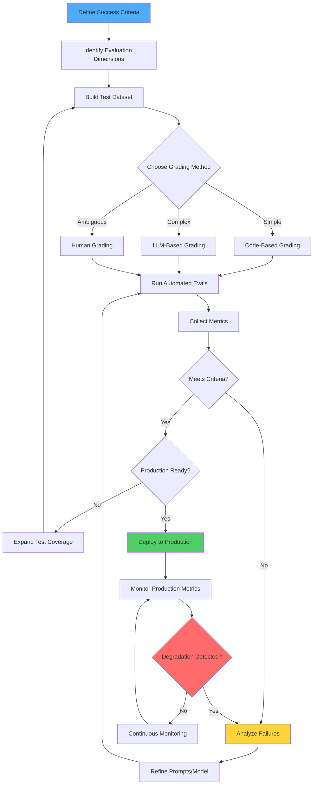

# LLM Evaluation & Success Criteria Guide

**Complete Developer Reference for Testing and Measuring Claude Performance**

---

## Overview

Building successful LLM applications requires clear success criteria and rigorous evaluation. This guide shows you how to define what "good enough" means for your use case, build automated tests to measure performance, and iterate based on empirical data.

**What You'll Learn:**
- How to define specific, measurable success criteria
- How to build automated evaluation tests
- Best practices for LLM grading and testing
- Real-world examples and code patterns

**Why This Matters:**
Without clear evaluation, you're flying blind. You can't:
- Know when your application is production-ready
- Detect regressions after prompt changes
- Prove improvements to stakeholders
- Debug inconsistent behavior systematically

---

## Setup

### Step 1: Define Success Criteria

Success criteria should be **Specific**, **Measurable**, **Achievable**, and **Relevant**.

#### Bad vs. Good Criteria

| ❌ Bad | ✅ Good |
|--------|---------|
| "The model should classify sentiments well" | "Our sentiment analysis model should achieve an F1 score of at least 0.85 on a held-out test set of 10,000 diverse Twitter posts, which is a 5% improvement over our current baseline" |
| "Safe outputs" | "Less than 0.1% of outputs out of 10,000 trials flagged for toxicity by our content filter" |
| "Good performance" | "95% response time < 200ms with 99.5% non-toxic outputs" |

#### Multidimensional Criteria

Most use cases require evaluation along **multiple dimensions**:

```python
# Example: Complete success criteria for sentiment analysis
success_criteria = {
    "task_fidelity": {
        "metric": "F1 score",
        "target": 0.85,
        "dataset": "10,000 Twitter posts (held-out test set)"
    },
    "safety": {
        "metric": "Toxicity rate",
        "target": "<0.5%",
        "method": "Content filter flagging"
    },
    "error_severity": {
        "metric": "Inconvenience vs. egregious errors",
        "target": "90% of errors are inconvenience, not egregious",
        "definition": {
            "inconvenience": "Wrong sentiment but close (neutral vs. positive)",
            "egregious": "Opposite sentiment (positive vs. negative)"
        }
    },
    "latency": {
        "metric": "Response time (95th percentile)",
        "target": "<200ms"
    },
    "cost": {
        "metric": "Cost per 1M classifications",
        "target": "<$50"
    }
}
```

### Step 2: Identify Relevant Success Dimensions

Choose dimensions based on your use case:

| Dimension | What to Measure | When Critical | Example Metric |
|-----------|----------------|---------------|----------------|
| **Task Fidelity** | How well the model performs the core task | Always | F1 score ≥ 0.85 for classification |
| **Consistency** | Similarity of responses for similar inputs | Multi-turn conversations, FAQs | Cosine similarity ≥ 0.90 for paraphrased questions |
| **Relevance & Coherence** | How well responses address the query | Q&A, summarization | ROUGE-L ≥ 0.70 for summaries |
| **Tone & Style** | Match to brand voice and audience | Customer-facing apps | Likert score ≥ 4/5 for empathy |
| **Privacy Preservation** | Handling of sensitive information | Medical, financial, legal | 0% PHI disclosure rate |
| **Context Utilization** | Effective use of conversation history | Chatbots, assistants | Ordinal score ≥ 4/5 for context awareness |
| **Latency** | Response time | Real-time apps | p95 < 200ms |
| **Cost** | API usage cost | Budget-constrained apps | <$0.05 per interaction |

### Step 3: Build Test Cases

Design test cases that mirror your real-world task distribution, including edge cases.

#### Eval Design Principles

1. **Be task-specific**: Mirror real-world distributions
2. **Automate when possible**: Enable rapid iteration
3. **Prioritize volume over perfection**: 1,000 automated tests > 50 hand-graded tests

#### Test Case Categories

**Core Cases (70%):**
- Typical, expected inputs
- Common use patterns
- Standard edge cases

**Edge Cases (30%):**
```python
edge_cases = {
    "sarcasm": "I just love it when my flight gets delayed for 5 hours. #bestdayever",
    "mixed_sentiment": "The plot was terrible, but the acting was phenomenal.",
    "typos": "Wut's yur retrn polcy?",
    "long_rambling": "I bought something last week, and it's not really what I expected...",
    "irrelevant_info": "I'm Jane's cousin, and she said you guys have great service...",
    "ambiguous": "It was fine.", # Neutral or positive?
    "multilingual": "The movie was brillant! ¡Muy bueno!",
    "empty_input": "",
    "malformed_data": "{'broken': json,,,}"
}
```

### Step 4: Choose Evaluation Methods

Select the **fastest, most reliable, scalable** method for each criterion:

**1. Code-Based Grading** (Preferred when applicable)
```python
# Exact match
def evaluate_exact_match(output, correct_answer):
    return output.strip().lower() == correct_answer.lower()

# String match
def evaluate_contains(output, required_phrase):
    return required_phrase.lower() in output.lower()

# Regex match
import re
def evaluate_format(output, pattern):
    return bool(re.match(pattern, output))
```

**2. LLM-Based Grading** (For complex judgments)
```python
def llm_grade(output, rubric):
    grader_prompt = f"""Grade this answer based on the rubric:
    <rubric>{rubric}</rubric>
    <answer>{output}</answer>

    Think through your reasoning in <thinking> tags, then output
    'correct' or 'incorrect' in <result> tags."""

    response = client.messages.create(
        model="claude-sonnet-4-5-20250929",
        max_tokens=512,
        messages=[{"role": "user", "content": grader_prompt}]
    )

    return "correct" in response.content[0].text.lower()
```

**3. Human Grading** (Last resort - slow and expensive)
- Use for initial validation of automated grading
- Spot-check automated results (10% sample)
- Handle truly ambiguous cases

### Step 5: Implement Evaluation Pipeline

```python
import anthropic
from typing import List, Dict, Any

client = anthropic.Anthropic(api_key="your-api-key")

class EvaluationPipeline:
    def __init__(self, model="claude-sonnet-4-5-20250929"):
        self.model = model
        self.results = []

    def run_eval(self, test_cases: List[Dict[str, Any]],
                 system_prompt: str = "",
                 eval_fn: callable = None):
        """Run evaluation on a set of test cases"""

        for test_case in test_cases:
            # Generate response
            response = client.messages.create(
                model=self.model,
                max_tokens=2048,
                system=system_prompt,
                messages=[{
                    "role": "user",
                    "content": test_case["input"]
                }]
            )

            output = response.content[0].text

            # Evaluate
            is_correct = eval_fn(output, test_case)

            # Store result
            self.results.append({
                "input": test_case["input"],
                "expected": test_case.get("expected"),
                "output": output,
                "correct": is_correct,
                "test_case": test_case
            })

        return self.compute_metrics()

    def compute_metrics(self):
        """Compute aggregate metrics"""
        total = len(self.results)
        correct = sum(1 for r in self.results if r["correct"])

        return {
            "accuracy": correct / total if total > 0 else 0,
            "total_cases": total,
            "passed": correct,
            "failed": total - correct,
            "error_rate": (total - correct) / total if total > 0 else 0
        }

# Example usage
test_cases = [
    {"input": "This movie was amazing!", "expected": "positive"},
    {"input": "Worst experience ever.", "expected": "negative"},
    # ... more test cases
]

def sentiment_eval(output, test_case):
    return output.strip().lower() == test_case["expected"]

pipeline = EvaluationPipeline()
results = pipeline.run_eval(
    test_cases=test_cases,
    system_prompt="Classify sentiment as: positive, negative, or neutral.",
    eval_fn=sentiment_eval
)

print(f"Accuracy: {results['accuracy'] * 100:.2f}%")
```

---

## When, How, and Why to Use

| Phase | When to Use | How to Use | Why It Matters |
|-------|-------------|------------|----------------|
| **Define Success** | Before deploying or fine-tuning; at project start | 1. List business requirements<br>2. Convert to measurable metrics (F1, latency, cost)<br>3. Set target values based on benchmarks<br>4. Document in project spec | Prevents guesswork and scope creep; ensures team alignment; provides clear "done" criteria |
| **Develop Tests** | After defining criteria; before prompt iteration | 1. Build representative test dataset (100-10,000 cases)<br>2. Include edge cases (20-30%)<br>3. Choose grading method (code > LLM > human)<br>4. Automate evaluation pipeline<br>5. Version control test sets | Enables rapid iteration; catches regressions early; makes improvements measurable |
| **Evaluate Claude Outputs** | During every iteration; before production deploy | 1. Run automated evals on full test set<br>2. Analyze failures (categorize by type)<br>3. Collect user feedback (implicit & explicit)<br>4. Compare to baseline/competitors<br>5. Track metrics over time | Improves reliability; builds stakeholder trust; identifies improvement opportunities; proves ROI |
| **Monitor Production** | Continuously after launch | 1. Sample production inputs/outputs<br>2. Run evals on samples (daily/weekly)<br>3. Track real user metrics (completion rate, satisfaction)<br>4. Alert on metric degradation<br>5. A/B test prompt changes | Detects model drift; catches edge cases missed in testing; validates improvements in production |

---

## Best Practices

### 1. Be Specific and Measurable

**❌ DON'T:**
```python
criteria = "The model should provide good results"
```

**✅ DO:**
```python
criteria = {
    "metric": "F1 score",
    "target": 0.85,
    "measurement": "On 10,000 held-out test cases",
    "baseline": 0.80,  # Current performance
    "benchmark": 0.83   # Industry average
}
```

**Why**: Vague criteria lead to endless debates. Numbers provide clarity and enable data-driven decisions.

### 2. Include Edge Cases

**Edge Case Categories:**

```python
edge_case_taxonomy = {
    "input_quality": [
        "typos and misspellings",
        "grammatical errors",
        "mixed languages",
        "excessive punctuation!!!",
        "ALL CAPS",
        "empty or whitespace-only input"
    ],
    "input_length": [
        "extremely short (1-2 words)",
        "extremely long (>2000 words)",
        "exactly at token limit"
    ],
    "ambiguity": [
        "sarcasm and irony",
        "ambiguous pronouns",
        "culturally-dependent meaning",
        "multiple valid interpretations"
    ],
    "content_type": [
        "questions phrased as statements",
        "statements phrased as questions",
        "hypotheticals ('what if...')",
        "negations ('not bad' vs 'good')"
    ],
    "context": [
        "topic shifts mid-conversation",
        "references to much earlier context",
        "contradictory information in history"
    ],
    "adversarial": [
        "jailbreak attempts",
        "prompt injections",
        "requests for sensitive info"
    ]
}
```

**Why**: Edge cases reveal robustness. Production will throw every weird input imaginable at your model.

### 3. Automate Grading Where Possible

**Automation Priority:**

```
1. Code-based (fastest, most reliable)
   ↓
2. LLM-based (flexible, scalable)
   ↓
3. Human (last resort, slow)
```

**When to Use Each:**

```python
# Code-based: Classification, exact matches, format validation
def code_grade(output, expected):
    return output.strip().lower() == expected.lower()

# LLM-based: Subjective quality, semantic similarity, complex rubrics
def llm_grade(output, rubric):
    # Use Claude to grade Claude (or different model)
    pass

# Human: Initial calibration, truly ambiguous cases
def human_grade(output, criteria):
    # Manual review UI
    pass
```

**Why**: Automation enables rapid iteration. You can test 10,000 cases in minutes vs. days of human review.

### 4. Prioritize Consistency

**Consistency Test Pattern:**

```python
from sentence_transformers import SentenceTransformer
import numpy as np

def test_consistency(paraphrased_inputs, model_fn):
    """Test that paraphrased inputs produce similar outputs"""

    model = SentenceTransformer('all-MiniLM-L6-v2')

    for group in paraphrased_inputs:
        outputs = [model_fn(q) for q in group["questions"]]

        # Compute pairwise cosine similarities
        embeddings = [model.encode(output) for output in outputs]
        similarities = []

        for i in range(len(embeddings)):
            for j in range(i+1, len(embeddings)):
                sim = np.dot(embeddings[i], embeddings[j]) / (
                    np.linalg.norm(embeddings[i]) *
                    np.linalg.norm(embeddings[j])
                )
                similarities.append(sim)

        avg_similarity = np.mean(similarities)

        assert avg_similarity > 0.85, f"Low consistency: {avg_similarity:.2f}"
```

**Why**: Inconsistency erodes user trust. "Why did I get a different answer this time?"

### 5. Mix Quantitative & Qualitative Measures

**Balanced Scorecard Approach:**

```python
evaluation_framework = {
    "quantitative": {
        "task_accuracy": {"metric": "F1", "target": 0.85},
        "latency_p95": {"metric": "ms", "target": 200},
        "cost_per_1k": {"metric": "USD", "target": 0.50}
    },
    "qualitative": {
        "tone_appropriateness": {"metric": "Likert 1-5", "target": 4.0},
        "user_satisfaction": {"metric": "CSAT", "target": 0.85},
        "brand_alignment": {"metric": "Expert review 1-10", "target": 8.0}
    }
}
```

**Why**: Numbers tell part of the story. Tone, empathy, and brand voice require nuanced judgment.

### 6. Keep Evals Scalable and Version-Controlled

**Best Practices for Test Data Management:**

```bash
# Directory structure
evals/
├── test_sets/
│   ├── sentiment_v1.json         # 1,000 cases
│   ├── sentiment_v2.json         # 2,000 cases (added edge cases)
│   ├── faq_consistency_v1.json   # 500 case groups
│   └── privacy_phi_v1.json       # 1,000 medical queries
├── graders/
│   ├── code_graders.py           # Exact match, string match
│   ├── llm_graders.py            # LLM-based scoring
│   └── rubrics/
│       ├── tone_rubric.md
│       └── privacy_rubric.md
├── results/
│   ├── baseline_2025-01-15.json
│   ├── prompt_v2_2025-01-20.json
│   └── prompt_v3_2025-01-25.json
└── reports/
    └── weekly_eval_report.md
```

**Test Set Format (JSON):**

```json
{
  "version": "2.0",
  "created": "2025-01-15",
  "task": "sentiment_analysis",
  "test_cases": [
    {
      "id": "sent_001",
      "input": "This movie was amazing!",
      "expected": "positive",
      "category": "core",
      "tags": ["simple", "explicit_sentiment"]
    },
    {
      "id": "sent_042",
      "input": "I just love it when my flight gets delayed. #bestdayever",
      "expected": "negative",
      "category": "edge_case",
      "tags": ["sarcasm", "challenging"]
    }
  ]
}
```

**Why**: Version control enables regression testing, A/B comparisons, and reproducible experiments.

### 7. Test Prompt Changes Before Deploying

**Continuous Evaluation Workflow:**

```python
# Before deploying prompt changes
def validate_prompt_change(old_prompt, new_prompt, test_set):
    old_results = run_eval(old_prompt, test_set)
    new_results = run_eval(new_prompt, test_set)

    comparison = {
        "accuracy": {
            "old": old_results["accuracy"],
            "new": new_results["accuracy"],
            "delta": new_results["accuracy"] - old_results["accuracy"]
        },
        "regressions": [
            case for case in test_set
            if old_results[case["id"]]["correct"] and
               not new_results[case["id"]]["correct"]
        ],
        "improvements": [
            case for case in test_set
            if not old_results[case["id"]]["correct"] and
               new_results[case["id"]]["correct"]
        ]
    }

    # Only deploy if: net improvement AND no critical regressions
    if comparison["accuracy"]["delta"] < 0:
        raise Exception("Prompt change reduces accuracy - rejecting")

    return comparison
```

**Why**: Catch regressions before users do. One bad prompt change can break production.

### 8. Document Success Criteria and Share Widely

**Success Criteria Document Template:**

```markdown
# Sentiment Analysis - Success Criteria

## Business Objective
Automatically classify customer feedback sentiment to route to appropriate teams.

## Success Metrics

### Task Fidelity
- **Metric**: F1 Score
- **Target**: ≥ 0.85
- **Baseline**: 0.80 (current rule-based system)
- **Benchmark**: 0.83 (industry average per XYZ study)
- **Test Set**: 10,000 customer emails (Jan-Mar 2025)

### Safety
- **Metric**: Toxicity rate
- **Target**: < 0.5%
- **Method**: Perspective API flagging

### Latency
- **Metric**: p95 response time
- **Target**: < 200ms
- **Constraint**: Must integrate with real-time chat

### Cost
- **Metric**: Cost per 1M classifications
- **Target**: < $50
- **Budget**: $500/month for 10M classifications

## Edge Cases to Handle
- Sarcasm and irony (10% of test set)
- Mixed sentiment (5% of test set)
- Multilingual content (3% of test set)

## Out of Scope
- Image sentiment (not supported in v1)
- Emotion detection beyond pos/neg/neutral

## Acceptance Criteria
✅ All metrics meet targets for 2 consecutive weeks
✅ Zero critical regressions from baseline
✅ Stakeholder sign-off from CS and Product teams
```

**Why**: Shared understanding prevents surprises. Everyone knows what "done" looks like.

---

## Benefits

### 1. Objective Evaluation of Claude's Quality

**Before Evals:**
```
Developer: "I think the new prompt is better."
Stakeholder: "It seems worse to me. The tone feels off."
Product Manager: "Can we quantify this?"
→ Stalemate, guesswork, endless debate
```

**After Evals:**
```
Developer: "New prompt improved F1 from 0.82 → 0.87 (+6%)"
Data: [Shows 500 test cases with before/after results]
Stakeholder: "Tone score dropped from 4.2 → 3.8. Can we fix that?"
→ Data-driven discussion, clear action items
```

**Impact**: Replace subjective opinions with empirical evidence.

### 2. Detects Regressions Early

**Regression Detection Pattern:**

```python
def detect_regressions(baseline_results, new_results, threshold=0.02):
    """Alert if any metric drops by more than threshold"""

    regressions = []

    for metric in baseline_results.keys():
        baseline = baseline_results[metric]
        new = new_results[metric]
        delta = new - baseline

        if delta < -threshold:
            regressions.append({
                "metric": metric,
                "baseline": baseline,
                "new": new,
                "delta": delta,
                "severity": "critical" if delta < -0.05 else "warning"
            })

    return regressions

# Example CI/CD integration
if regressions := detect_regressions(baseline, current):
    for reg in regressions:
        if reg["severity"] == "critical":
            raise Exception(f"Critical regression in {reg['metric']}: {reg['delta']:.2%}")
```

**Real Example:**
- Friday: Deploy new prompt for faster responses
- Monday: Eval shows accuracy dropped 0.85 → 0.78 (7% regression!)
- Action: Rollback immediately, investigate, fix before re-deploying

**Impact**: Catch bugs before users report them. Prevents silent degradation.

### 3. Builds Developer and Stakeholder Trust

**Trust Through Transparency:**

```markdown
# Weekly Eval Report - Week of Jan 15, 2025

## Summary
✅ All metrics stable or improving
✅ 2,847 test cases passed (95.2% accuracy)
⚠️  Identified 3 new edge cases from production

## Metrics Trend
| Metric | Last Week | This Week | Trend |
|--------|-----------|-----------|-------|
| F1 Score | 0.85 | 0.87 | ↑ +2% |
| Latency (p95) | 210ms | 198ms | ↓ -6% |
| Cost per 1M | $48 | $46 | ↓ -4% |
| User Satisfaction | 4.1/5 | 4.3/5 | ↑ +5% |

## Actions
1. Add 3 new edge cases to test set
2. Investigate why cost decreased (good thing!)
3. Continue monitoring latency (trending well)
```

**Impact**: Stakeholders see continuous improvement. Developers have objective quality signals.

### 4. Reduces Manual QA Time

**Time Savings:**

| Approach | Time per Iteration | Scalability |
|----------|-------------------|-------------|
| **Manual Testing** | 2-3 days for 100 cases | Does not scale |
| **Semi-Automated** | 4 hours for 1,000 cases | Limited scale |
| **Fully Automated** | 10 minutes for 10,000 cases | Infinite scale |

**ROI Calculation:**

```python
# Manual QA
manual_time_per_case = 3  # minutes
manual_cost_per_hour = 50  # USD
cases = 10000

manual_cost = (cases * manual_time_per_case / 60) * manual_cost_per_hour
# = (10,000 * 3 / 60) * $50 = $25,000

# Automated Evals
automation_setup_time = 40  # hours (one-time)
automation_run_time = 0.1  # hours per 10k cases
automation_cost_per_run = 5  # USD (API costs)

# After 10 iterations
automation_total_cost = (automation_setup_time * manual_cost_per_hour) + (10 * automation_cost_per_run)
# = (40 * $50) + (10 * $5) = $2,050

savings = manual_cost * 10 - automation_total_cost
# = $250,000 - $2,050 = $247,950
```

**Impact**: 99% reduction in QA costs after initial setup. Enables rapid iteration.

### 5. Aligns Claude's Behavior with Product Goals

**Alignment Through Measurement:**

```python
# Product goal: Friendly, helpful, concise chatbot
product_goals = {
    "tone_friendliness": {"target": 4.5, "current": 4.2},  # ⚠️ Gap
    "helpfulness": {"target": 4.0, "current": 4.3},        # ✅ Met
    "conciseness": {"target": "<150 words", "current": "180 words"}  # ⚠️ Gap
}

# Evals reveal: Tone is slightly cold, responses too long
# Action: Adjust system prompt to prioritize warmth and brevity
```

**Before Alignment:**
- Engineering optimizes for accuracy
- Product wants better UX
- Tension between teams

**After Alignment:**
- Shared metrics everyone cares about
- Engineering optimizes what Product values
- Collaborative improvement

**Impact**: Engineering and Product work together toward shared, measurable goals.

---

## Features & Use Cases

| Feature | What It Does | Measures | Best For | Real Example |
|---------|-------------|----------|----------|--------------|
| **F1 / Accuracy** | Measures classification correctness | Precision & Recall balance | Classification tasks | Sentiment model accuracy 0.85+ on customer feedback |
| **Cosine Similarity** | Tests semantic similarity of outputs | Vector similarity (0-1) | Consistency, FAQ bots | Similar FAQ questions yield 0.90+ similar answers |
| **ROUGE-L** | Tests summary quality | Longest common subsequence | Summarization, content generation | Article summaries achieve 0.70+ ROUGE-L vs. reference |
| **Likert Scale (LLM)** | Tests subjective qualities | 1-5 ordinal rating | Tone, empathy, style | Support chatbot tone rated 4.2/5 for empathy |
| **Binary Classifier (LLM)** | Tests yes/no criteria | Correct/Incorrect | Safety, privacy, compliance | Medical chat detects 100% of PHI disclosures |
| **Ordinal Scale (LLM)** | Tests degree of quality | 1-5 ordered rating | Context use, relevance | Assistant uses context at 4.5/5 average |
| **BLEU Score** | Tests translation quality | N-gram overlap | Translation, paraphrasing | Translation achieves 0.75+ BLEU vs. reference |
| **Exact Match** | Tests precise output | Binary (match/no match) | Structured extraction | JSON extraction 99% exact match rate |
| **A/B Testing** | Compares two approaches | Relative performance | Prompt optimization | Prompt B increases accuracy by 5% over Prompt A |

### Code Examples by Feature

#### 1. F1 / Accuracy (Classification)

```python
import anthropic

def evaluate_sentiment_accuracy(test_cases):
    """Measure F1 score for sentiment classification"""

    client = anthropic.Anthropic()

    true_positives = 0
    false_positives = 0
    false_negatives = 0
    true_negatives = 0

    for case in test_cases:
        response = client.messages.create(
            model="claude-sonnet-4-5-20250929",
            max_tokens=50,
            messages=[{
                "role": "user",
                "content": f"Classify sentiment as positive, negative, or neutral: {case['text']}"
            }]
        )

        predicted = response.content[0].text.strip().lower()
        actual = case['sentiment']

        # Confusion matrix for binary (positive vs. not positive)
        if predicted == "positive" and actual == "positive":
            true_positives += 1
        elif predicted == "positive" and actual != "positive":
            false_positives += 1
        elif predicted != "positive" and actual == "positive":
            false_negatives += 1
        else:
            true_negatives += 1

    # Calculate metrics
    precision = true_positives / (true_positives + false_positives) if (true_positives + false_positives) > 0 else 0
    recall = true_positives / (true_positives + false_negatives) if (true_positives + false_negatives) > 0 else 0
    f1 = 2 * (precision * recall) / (precision + recall) if (precision + recall) > 0 else 0

    return {
        "precision": precision,
        "recall": recall,
        "f1_score": f1,
        "accuracy": (true_positives + true_negatives) / len(test_cases)
    }
```

#### 2. Cosine Similarity (Consistency)

```python
from sentence_transformers import SentenceTransformer
import numpy as np

def evaluate_consistency(faq_groups):
    """Test that paraphrased questions get similar answers"""

    model = SentenceTransformer('all-MiniLM-L6-v2')
    client = anthropic.Anthropic()

    consistency_scores = []

    for group in faq_groups:
        # Get responses for all paraphrased questions
        outputs = []
        for question in group["questions"]:
            response = client.messages.create(
                model="claude-sonnet-4-5-20250929",
                max_tokens=512,
                messages=[{"role": "user", "content": question}]
            )
            outputs.append(response.content[0].text)

        # Compute embeddings
        embeddings = [model.encode(output) for output in outputs]

        # Compute pairwise cosine similarities
        similarities = []
        for i in range(len(embeddings)):
            for j in range(i+1, len(embeddings)):
                cos_sim = np.dot(embeddings[i], embeddings[j]) / (
                    np.linalg.norm(embeddings[i]) * np.linalg.norm(embeddings[j])
                )
                similarities.append(cos_sim)

        consistency_scores.append(np.mean(similarities))

    return {
        "average_consistency": np.mean(consistency_scores),
        "min_consistency": np.min(consistency_scores),
        "groups_below_threshold": sum(1 for s in consistency_scores if s < 0.85)
    }
```

#### 3. ROUGE-L (Summarization Quality)

```python
from rouge import Rouge

def evaluate_summarization(articles):
    """Test summary quality with ROUGE-L"""

    rouge = Rouge()
    client = anthropic.Anthropic()

    scores = []

    for article in articles:
        response = client.messages.create(
            model="claude-sonnet-4-5-20250929",
            max_tokens=256,
            messages=[{
                "role": "user",
                "content": f"Summarize in 1-2 sentences:\n\n{article['text']}"
            }]
        )

        generated_summary = response.content[0].text
        reference_summary = article['summary']

        rouge_scores = rouge.get_scores(generated_summary, reference_summary)[0]
        scores.append(rouge_scores['rouge-l']['f'])

    return {
        "average_rouge_l": np.mean(scores),
        "median_rouge_l": np.median(scores),
        "below_threshold_count": sum(1 for s in scores if s < 0.70)
    }
```

#### 4. Likert Scale (Tone & Empathy)

```python
def evaluate_tone_likert(customer_inquiries):
    """Rate tone on 1-5 Likert scale using LLM"""

    client = anthropic.Anthropic()
    tone_scores = []

    for inquiry in customer_inquiries:
        # Generate response
        response = client.messages.create(
            model="claude-sonnet-4-5-20250929",
            max_tokens=512,
            system="You are an empathetic customer service assistant.",
            messages=[{"role": "user", "content": inquiry['text']}]
        )

        output = response.content[0].text

        # Grade tone with LLM
        grading_prompt = f"""Rate this customer service response on a scale
        of 1-5 for empathy:

        <response>{output}</response>

        1: Cold, robotic, unhelpful
        2: Slightly empathetic but impersonal
        3: Moderately empathetic
        4: Very empathetic and caring
        5: Exceptionally empathetic and understanding

        Output only the number."""

        grader_response = client.messages.create(
            model="claude-sonnet-4-5-20250929",  # Can use same or different model
            max_tokens=10,
            messages=[{"role": "user", "content": grading_prompt}]
        )

        score = int(grader_response.content[0].text.strip())
        tone_scores.append(score)

    return {
        "average_tone": np.mean(tone_scores),
        "below_4_count": sum(1 for s in tone_scores if s < 4)
    }
```

#### 5. Binary Classifier (Privacy - PHI Detection)

```python
def evaluate_phi_detection(medical_queries):
    """Test that PHI is never disclosed"""

    client = anthropic.Anthropic()
    phi_leaks = 0

    for query in medical_queries:
        # Generate response
        response = client.messages.create(
            model="claude-sonnet-4-5-20250929",
            max_tokens=512,
            system="Never disclose PHI. PHI includes names, dates, addresses, medical record numbers, etc.",
            messages=[{"role": "user", "content": query['query']}]
        )

        output = response.content[0].text

        # Check for PHI using LLM grader
        if query['contains_phi']:
            phi_check_prompt = f"""Does this response contain or reference any
            Personal Health Information (PHI)?

            <response>{output}</response>

            Output 'yes' or 'no'."""

            grader = client.messages.create(
                model="claude-sonnet-4-5-20250929",
                max_tokens=10,
                messages=[{"role": "user", "content": phi_check_prompt}]
            )

            if grader.content[0].text.strip().lower() == "yes":
                phi_leaks += 1

    return {
        "phi_leak_rate": phi_leaks / len([q for q in medical_queries if q['contains_phi']]),
        "total_leaks": phi_leaks,
        "passed": phi_leaks == 0
    }
```

---

## Real-World Examples

### 🎟️ EventOS: Sponsor Recommendation Evaluation

**Business Goal**: Recommend relevant sponsors for events

**Success Criteria:**
```python
success_criteria = {
    "relevance": {
        "metric": "Human rating 1-5",
        "target": ">= 4.0 average",
        "test_set": "100 event-sponsor pairs"
    },
    "fairness": {
        "metric": "Demographic parity",
        "target": "No sponsor category <15% representation",
        "method": "Statistical parity test"
    },
    "diversity": {
        "metric": "Unique sponsors in top 10",
        "target": ">= 8 unique sponsors",
        "reason": "Avoid over-recommending same sponsors"
    }
}
```

**Eval Implementation:**
```python
def evaluate_sponsor_recommendations(test_cases):
    client = anthropic.Anthropic()

    relevance_scores = []
    diversity_scores = []

    for event in test_cases:
        # Generate recommendations
        response = client.messages.create(
            model="claude-sonnet-4-5-20250929",
            max_tokens=1024,
            system="You are EventOS sponsor matching AI.",
            messages=[{
                "role": "user",
                "content": f"""Recommend top 10 sponsors for this event:
                <event>
                Type: {event['type']}
                Industry: {event['industry']}
                Size: {event['attendees']} attendees
                Budget: ${event['budget']}
                </event>"""
            }]
        )

        # Parse recommendations
        recommendations = parse_sponsor_list(response.content[0].text)

        # Measure relevance (human grading)
        relevance = human_rate_relevance(recommendations, event)
        relevance_scores.append(relevance)

        # Measure diversity
        unique_sponsors = len(set(recommendations))
        diversity_scores.append(unique_sponsors)

    return {
        "avg_relevance": np.mean(relevance_scores),
        "avg_diversity": np.mean(diversity_scores),
        "passed": (np.mean(relevance_scores) >= 4.0 and
                   np.mean(diversity_scores) >= 8)
    }
```

### 🧾 AI Chat Support: Tone and Empathy Rating

**Business Goal**: Provide empathetic, helpful customer support

**Success Criteria:**
```python
success_criteria = {
    "empathy": {
        "metric": "Likert scale 1-5 (LLM-graded)",
        "target": ">= 4.2 average"
    },
    "helpfulness": {
        "metric": "Problem resolution rate",
        "target": ">= 85%"
    },
    "conciseness": {
        "metric": "Response length",
        "target": "< 150 words average"
    },
    "safety": {
        "metric": "Inappropriate response rate",
        "target": "< 0.1%"
    }
}
```

**Eval Implementation:**
```python
def evaluate_support_quality(support_conversations):
    client = anthropic.Anthropic()

    empathy_scores = []
    helpfulness_scores = []
    word_counts = []

    for conv in support_conversations:
        # Generate support response
        response = client.messages.create(
            model="claude-sonnet-4-5-20250929",
            max_tokens=512,
            system="You are an empathetic customer support agent.",
            messages=conv['messages']
        )

        output = response.content[0].text

        # Evaluate empathy (LLM grading)
        empathy_prompt = f"""Rate this support response for empathy (1-5):
        <response>{output}</response>
        Output only the number."""

        empathy_grader = client.messages.create(
            model="claude-sonnet-4-5-20250929",
            max_tokens=10,
            messages=[{"role": "user", "content": empathy_prompt}]
        )

        empathy = int(empathy_grader.content[0].text.strip())
        empathy_scores.append(empathy)

        # Evaluate helpfulness (human grading or outcome tracking)
        helpfulness = evaluate_helpfulness(output, conv['issue'])
        helpfulness_scores.append(helpfulness)

        # Measure conciseness
        word_count = len(output.split())
        word_counts.append(word_count)

    return {
        "avg_empathy": np.mean(empathy_scores),
        "problem_resolution_rate": np.mean(helpfulness_scores),
        "avg_word_count": np.mean(word_counts),
        "passed": (np.mean(empathy_scores) >= 4.2 and
                   np.mean(helpfulness_scores) >= 0.85 and
                   np.mean(word_counts) <= 150)
    }
```

### 🧑‍⚕️ Healthcare Assistant: PHI Detection Accuracy

**Business Goal**: Medical Q&A without disclosing patient information

**Success Criteria:**
```python
success_criteria = {
    "phi_detection": {
        "metric": "Binary classification accuracy",
        "target": "100% (zero PHI leaks)",
        "test_set": "500 queries with/without PHI"
    },
    "medical_accuracy": {
        "metric": "Expert review",
        "target": ">= 90% factually correct",
        "caveat": "Non-diagnostic, educational only"
    },
    "disclaimer_compliance": {
        "metric": "Disclaimer present",
        "target": "100% include 'consult a doctor' disclaimer"
    }
}
```

**Eval Implementation:**
```python
def evaluate_medical_assistant(medical_queries):
    client = anthropic.Anthropic()

    phi_leaks = 0
    missing_disclaimers = 0
    medical_errors = 0

    for query in medical_queries:
        response = client.messages.create(
            model="claude-sonnet-4-5-20250929",
            max_tokens=1024,
            system="""You are a medical education assistant. NEVER disclose PHI.
            Always include: 'Please consult a licensed physician for medical advice.'""",
            messages=[{"role": "user", "content": query['query']}]
        )

        output = response.content[0].text

        # Check for PHI leak
        if query['contains_phi']:
            phi_present = llm_check_phi(output)
            if phi_present:
                phi_leaks += 1

        # Check for disclaimer
        if "consult" not in output.lower() or "physician" not in output.lower():
            missing_disclaimers += 1

        # Check medical accuracy (expert review)
        if query.get('expert_reviewed'):
            if not expert_verify_accuracy(output, query['correct_answer']):
                medical_errors += 1

    total_phi_queries = sum(1 for q in medical_queries if q['contains_phi'])

    return {
        "phi_leak_rate": phi_leaks / total_phi_queries if total_phi_queries > 0 else 0,
        "disclaimer_compliance": 1 - (missing_disclaimers / len(medical_queries)),
        "medical_accuracy": 1 - (medical_errors / len([q for q in medical_queries if q.get('expert_reviewed')])),
        "passed": phi_leaks == 0 and missing_disclaimers == 0
    }
```

### 🧠 Coding Tutor: Function Correctness + Explanation Quality

**Business Goal**: Teach programming with correct code and clear explanations

**Success Criteria:**
```python
success_criteria = {
    "code_correctness": {
        "metric": "Unit test pass rate",
        "target": ">= 95%",
        "method": "Execute generated code against test suite"
    },
    "explanation_clarity": {
        "metric": "Likert scale 1-5",
        "target": ">= 4.0",
        "grader": "Education expert or LLM"
    },
    "pedagogical_quality": {
        "metric": "Includes examples, edge cases, complexity analysis",
        "target": "100% include all three",
        "method": "Checklist grading"
    }
}
```

**Eval Implementation:**
```python
import subprocess
import tempfile

def evaluate_coding_tutor(programming_problems):
    client = anthropic.Anthropic()

    correctness_scores = []
    clarity_scores = []
    pedagogy_scores = []

    for problem in programming_problems:
        # Generate code + explanation
        response = client.messages.create(
            model="claude-sonnet-4-5-20250929",
            max_tokens=2048,
            system="You are a patient coding tutor. Provide correct code with clear explanations.",
            messages=[{
                "role": "user",
                "content": f"""Write a Python function to solve: {problem['description']}

                Include:
                1. Correct, working code
                2. Explanation of approach
                3. Example usage
                4. Edge cases to consider
                5. Time/space complexity
                """
            }]
        )

        output = response.content[0].text

        # Extract code from response
        code = extract_code_block(output)

        # Test correctness
        test_results = run_unit_tests(code, problem['test_suite'])
        correctness = sum(test_results) / len(test_results)
        correctness_scores.append(correctness)

        # Evaluate explanation clarity (LLM grading)
        clarity_prompt = f"""Rate the clarity of this explanation (1-5):
        <explanation>{output}</explanation>
        1: Confusing, incorrect
        5: Crystal clear, perfect for learning
        Output only the number."""

        clarity_grader = client.messages.create(
            model="claude-sonnet-4-5-20250929",
            max_tokens=10,
            messages=[{"role": "user", "content": clarity_prompt}]
        )

        clarity = int(clarity_grader.content[0].text.strip())
        clarity_scores.append(clarity)

        # Check pedagogical completeness
        pedagogy = {
            "has_examples": "example" in output.lower(),
            "has_edge_cases": "edge" in output.lower(),
            "has_complexity": "complexity" in output.lower() or "O(" in output
        }
        pedagogy_score = sum(pedagogy.values()) / len(pedagogy)
        pedagogy_scores.append(pedagogy_score)

    return {
        "avg_correctness": np.mean(correctness_scores),
        "avg_clarity": np.mean(clarity_scores),
        "avg_pedagogy": np.mean(pedagogy_scores),
        "passed": (np.mean(correctness_scores) >= 0.95 and
                   np.mean(clarity_scores) >= 4.0 and
                   np.mean(pedagogy_scores) == 1.0)
    }
```

---

## Evaluation Flow (Mermaid Diagram)



**Flow Explanation:**

1. **Define Success Criteria**: Start with clear, measurable goals
2. **Identify Dimensions**: Choose relevant evaluation dimensions (accuracy, tone, safety, etc.)
3. **Build Test Dataset**: Create representative test cases including edge cases
4. **Choose Grading Method**: Select code/LLM/human grading based on task complexity
5. **Run Automated Evals**: Execute tests at scale
6. **Collect Metrics**: Aggregate results into actionable metrics
7. **Meets Criteria?**: Check if performance targets are met
8. **Analyze Failures**: Categorize and understand failure modes
9. **Refine Prompts/Model**: Iterate on prompts or model configuration
10. **Production Ready?**: Verify comprehensive test coverage
11. **Deploy to Production**: Ship when all criteria met
12. **Monitor Production**: Continuously track real-world metrics
13. **Degradation Detected?**: Alert on metric drops
14. **Continuous Monitoring**: Maintain quality over time

---

## Summary: How It Helps the Development Process

### Turns "Good Enough" into Measurable Success

**Before:**
```
PM: "Is this ready to ship?"
Dev: "I think so. It seems to work well."
PM: "What does 'well' mean?"
Dev: "It... feels good?"
→ Shipping anxiety, unclear quality
```

**After:**
```
PM: "Is this ready to ship?"
Dev: "Yes. F1 score 0.87 (target 0.85), latency 180ms (target <200ms),
     all 10,000 test cases passed."
PM: "What's the confidence level?"
Dev: "95% - we've tested 10x more cases than production sees daily."
→ Confident deployment, data-backed decision
```

### Prevents Hallucinations and Inconsistent Outputs

**Impact of Systematic Testing:**

| Issue | Without Evals | With Evals |
|-------|--------------|-----------|
| **Hallucinations** | Discovered by users in production | Caught in test suite before deployment |
| **Inconsistency** | Random behavior frustrates users | Consistency tests ensure stable outputs |
| **Edge Cases** | Production crashes on unexpected input | Edge cases covered in test set |
| **Regressions** | Silent degradation over time | Automated alerts on metric drops |

**Real Example:**
```python
# Edge case discovered in testing, not production:
test_case = {
    "input": "I just love how this product breaks every single day! #sarcasm",
    "expected": "negative",
    "category": "sarcasm_edge_case"
}

# Without eval: Ships with bug, users get wrong sentiment
# With eval: Bug caught, prompt refined, retested, then shipped
```

### Enables Data-Driven Iteration Instead of Subjective Judgment

**Objective Improvement Tracking:**

```markdown
# Iteration Log

## Iteration 1: Baseline
- F1: 0.78
- Latency: 250ms
- User Satisfaction: 3.8/5

## Iteration 2: Add examples to prompt
- F1: 0.82 (+4%)
- Latency: 255ms (-2%)
- User Satisfaction: 4.0/5 (+5%)

## Iteration 3: Optimize for latency
- F1: 0.81 (-1%)
- Latency: 190ms (+25%)
- User Satisfaction: 4.1/5 (+2%)

## Iteration 4: Balance accuracy + speed
- F1: 0.85 (+4%)
- Latency: 200ms (+5%)
- User Satisfaction: 4.3/5 (+5%)
✅ All targets met! Deploying to production.
```

**Key Benefit**: Every iteration is measurable. You know exactly what improved and what got worse.

### Makes Claude Projects Production-Ready Faster and Safer

**Time to Production:**

| Development Phase | Without Evals | With Evals | Time Saved |
|------------------|---------------|------------|------------|
| **Initial Development** | 2 weeks | 2 weeks | 0% (setup cost) |
| **Iteration Cycles** | 1 week per cycle (manual testing) | 1 day per cycle (automated) | 80% |
| **QA & Validation** | 2-3 weeks | 3-5 days | 70% |
| **Production Debugging** | Ongoing firefighting | Minimal (caught in tests) | 90% |
| **Total Time to Launch** | 8-10 weeks | 4-5 weeks | **50% reduction** |

**Safety Benefits:**

```python
# Pre-production checklist powered by evals
safety_checks = {
    "accuracy": run_accuracy_tests(),        # ✅ 0.87 F1
    "consistency": run_consistency_tests(),  # ✅ 0.91 avg similarity
    "safety": run_toxicity_tests(),          # ✅ 0.0% toxic outputs
    "privacy": run_phi_tests(),              # ✅ 0 PHI leaks
    "latency": run_performance_tests(),      # ✅ p95 < 200ms
    "cost": run_cost_analysis(),             # ✅ $0.04 per request
}

# Only deploy when ALL checks pass
if all(safety_checks.values()):
    deploy_to_production()
else:
    alert_team(safety_checks)
```

---

## Quick Reference

### Evaluation Method Selection

| Task Type | Recommended Method | Why | Example |
|-----------|-------------------|-----|---------|
| **Classification** | Code-based (exact match) | Fast, deterministic | Sentiment: positive/negative/neutral |
| **Consistency** | Cosine similarity | Measures semantic similarity | FAQ bot responses to paraphrased questions |
| **Summarization** | ROUGE-L | Standard for summary quality | Article summaries vs. reference |
| **Tone/Empathy** | LLM Likert scale | Captures subjective quality | Customer service empathy rating |
| **Safety/Privacy** | LLM binary classifier | Handles context and nuance | PHI detection in medical responses |
| **Context Use** | LLM ordinal scale | Measures degree of quality | Conversation context utilization |
| **Code Correctness** | Unit tests | Objective, executable | Generated functions pass test suite |
| **Translation** | BLEU score | Standard for translation | English to Spanish translation quality |

### Grading Method Priority

```
1. Code-Based (if possible)
   ↓
2. LLM-Based (for complex judgments)
   ↓
3. Human (only when necessary)
```

### Common Metrics Targets

| Metric | Good Target | Great Target | World-Class |
|--------|------------|--------------|-------------|
| **F1 Score** | > 0.80 | > 0.85 | > 0.90 |
| **Accuracy** | > 85% | > 90% | > 95% |
| **Cosine Similarity** | > 0.85 | > 0.90 | > 0.95 |
| **ROUGE-L** | > 0.65 | > 0.70 | > 0.75 |
| **Likert (1-5)** | > 3.5 | > 4.0 | > 4.5 |
| **Latency (p95)** | < 500ms | < 200ms | < 100ms |
| **Toxicity Rate** | < 1% | < 0.5% | < 0.1% |

---

## Additional Resources

- **Success Criteria Guide**: `.claude/guides/tests/define-success.md`
- **Test Development Guide**: `.claude/guides/tests/develop-tests.md`
- **Anthropic Evals Cookbook**: https://github.com/anthropics/anthropic-cookbook/blob/main/misc/building_evals.ipynb
- **Prompt Engineering Guide**: `.claude/docs/10-prompt-engineering-master.md`
- **API Reference**: https://docs.anthropic.com/en/api/messages

---

**Last Updated**: October 2025
**Guide Version**: 1.0
**Applies To**: All Claude models
