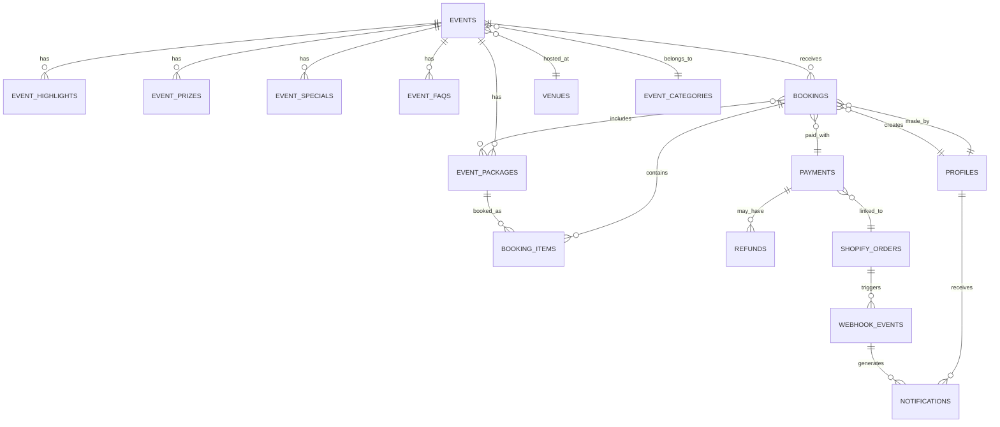

# 🎯 **SKYBOX GAMEHUB - EVENT SYSTEM PRODUCTION PLAN**
## **Comprehensive Database Architecture & Implementation Roadmap**

---

## **📊 CURRENT STATE ANALYSIS**

### **✅ Existing Infrastructure**
- **Database**: Supabase PostgreSQL with RLS enabled
- **Frontend**: React 18 + TypeScript + Vite (Port 8081 ✅)
- **Current Tables**: `leagues`, `teams`, `games`, `profiles`, `skybox_featured_games`
- **Events Schema**: Comprehensive events system (705 lines) - **ALREADY EXISTS**
- **Security**: RLS policies implemented across all tables

### **🔍 Critical Issues Identified**
1. **TypeScript Configuration**: Strict mode disabled, 49 ESLint violations
2. **Database Schema**: Mixed ID types (BIGINT vs UUID), inconsistent naming
3. **Security**: Hardcoded Supabase credentials in client code
4. **Missing Components**: Bookings, payments, Shopify integration, WhatsApp automation

---

## **🏗️ ENHANCED EVENT SYSTEM ARCHITECTURE**

### **📋 Schema Dependencies (Declarative Order)**
```
supabase/schemas/
├── 01_leagues.sql              ✅ EXISTS
├── 02_teams.sql                ✅ EXISTS  
├── 03_games.sql                ✅ EXISTS
├── 04_skybox_featured_games.sql ✅ EXISTS
├── 05_profiles.sql             ✅ EXISTS
├── 06_event_categories.sql     ✅ EXISTS (in events schema)
├── 07_venues.sql               ✅ EXISTS (in events schema)
├── 08_events.sql               ✅ EXISTS (in events schema)
├── 09_bookings.sql             ❌ MISSING - CRITICAL
├── 10_payments.sql             ❌ MISSING - CRITICAL
├── 11_shopify_integration.sql  ❌ MISSING - CRITICAL
├── 12_whatsapp_notifications.sql ❌ MISSING - CRITICAL
└── 13_functions_and_triggers.sql ❌ MISSING
```

### **🔗 Entity Relationship Diagram**


---

## **🔐 RLS & SECURITY MATRIX**

| **Role** | **Events** | **Bookings** | **Payments** | **Profiles** | **Notifications** |
|----------|------------|--------------|--------------|--------------|-------------------|
| **Anonymous** | Read published | None | None | None | None |
| **Authenticated** | Read published | Own bookings | Own payments | Own profile | Own notifications |
| **Staff** | Full CRUD | Read all | Read all | Read all | Full CRUD |
| **Admin** | Full CRUD | Full CRUD | Full CRUD | Full CRUD | Full CRUD |

---

## **📋 COMPREHENSIVE TODO LIST**

| **Task** | **Description** | **Priority** | **Owner** | **Est. Time** | **Dependencies** |
|----------|-----------------|--------------|-----------|---------------|------------------|
| **P0 - CRITICAL FOUNDATION** |
| 1.1 | Fix TypeScript configuration (enable strict mode) | P0 | Dev Team | 2h | None |
| 1.2 | Resolve ESLint errors (49 violations) | P0 | Dev Team | 4h | 1.1 |
| 1.3 | Move hardcoded Supabase credentials to env vars | P0 | Dev Team | 1h | None |
| 1.4 | Standardize database ID types (BIGINT vs UUID) | P0 | DB Team | 3h | None |
| **P1 - BOOKING SYSTEM** |
| 2.1 | Create 09_bookings.sql schema file | P1 | DB Team | 4h | 1.4 |
| 2.2 | Create booking_items junction table | P1 | DB Team | 2h | 2.1 |
| 2.3 | Create 10_payments.sql schema file | P1 | DB Team | 3h | 2.1 |
| 2.4 | Implement booking validation triggers | P1 | DB Team | 4h | 2.2 |
| 2.5 | Create booking status workflow functions | P1 | DB Team | 3h | 2.4 |
| **P1 - SHOPIFY INTEGRATION** |
| 3.1 | Create 11_shopify_integration.sql schema | P1 | DB Team | 2h | 2.3 |
| 3.2 | Create webhook_events table for Shopify | P1 | DB Team | 2h | 3.1 |
| 3.3 | Build Shopify webhook Edge Function | P1 | Backend Team | 6h | 3.2 |
| 3.4 | Implement HMAC validation for webhooks | P1 | Backend Team | 3h | 3.3 |
| 3.5 | Create idempotency handling for webhooks | P1 | Backend Team | 4h | 3.4 |
| **P1 - WHATSAPP AUTOMATION** |
| 4.1 | Create 12_whatsapp_notifications.sql schema | P1 | DB Team | 2h | None |
| 4.2 | Create notification_templates table | P1 | DB Team | 2h | 4.1 |
| 4.3 | Build WhatsApp notification Edge Function | P1 | Backend Team | 8h | 4.2 |
| 4.4 | Implement notification scheduling system | P1 | Backend Team | 6h | 4.3 |
| 4.5 | Create notification delivery tracking | P1 | DB Team | 3h | 4.4 |
| **P2 - ADVANCED FEATURES** |
| 5.1 | Create promo_codes and discounts tables | P2 | DB Team | 3h | 2.1 |
| 5.2 | Create menus and menu_items tables | P2 | DB Team | 3h | None |
| 5.3 | Create audit_logs table for compliance | P2 | DB Team | 2h | None |
| 5.4 | Implement soft delete for all tables | P2 | DB Team | 4h | None |
| 5.5 | Create performance monitoring functions | P2 | DB Team | 3h | None |
| **P2 - TESTING & VALIDATION** |
| 6.1 | Write SQL unit tests for RLS policies | P2 | QA Team | 8h | 2.1-4.5 |
| 6.2 | Create integration tests for Edge Functions | P2 | QA Team | 6h | 3.3, 4.3 |
| 6.3 | Implement load testing for booking system | P2 | QA Team | 4h | 2.1-2.5 |
| 6.4 | Create backup and rollback procedures | P2 | DevOps Team | 4h | All DB changes |
| 6.5 | Document API endpoints and webhooks | P2 | Dev Team | 6h | 3.3, 4.3 |
| **P2 - PERFORMANCE & OPS** |
| 7.1 | Create composite indexes for booking queries | P2 | DB Team | 2h | 2.1-2.2 |
| 7.2 | Implement caching strategy for events | P2 | Backend Team | 4h | None |
| 7.3 | Set up monitoring and alerting | P2 | DevOps Team | 6h | All systems |
| 7.4 | Create data retention policies | P2 | DB Team | 3h | 5.3 |
| 7.5 | Implement rate limiting for APIs | P2 | Backend Team | 4h | 3.3, 4.3 |

---

## **🔧 MIGRATION STRATEGY (Declarative Schema)**

### **Phase 1: Foundation (Week 1)**
```bash
# 1. Fix critical issues first
V2025_11_01_001_fix_typescript_config.sql
V2025_11_01_002_standardize_id_types.sql  
V2025_11_01_003_create_bookings_system.sql
V2025_11_01_004_create_payment_tracking.sql
```

### **Phase 2: Integrations (Week 2)**
```bash
# 2. Add missing schema files
V2025_11_08_001_create_shopify_integration.sql
V2025_11_08_002_create_whatsapp_notifications.sql
V2025_11_08_003_create_webhook_system.sql
```

### **Phase 3: Advanced Features (Week 3)**
```bash
# 3. Complete the system
V2025_11_15_001_create_promo_system.sql
V2025_11_15_002_create_menu_system.sql
V2025_11_15_003_create_audit_logging.sql
```

### **Migration Workflow (Declarative)**
```bash
# 1. Define schema in supabase/schemas/
# 2. Stop local Supabase
supabase stop

# 3. Generate migration from schema
supabase db diff --schema public > supabase/migrations/$(date +%Y%m%d%H%M%S)_schema_update.sql

# 4. Review generated migration
# 5. Apply migration
supabase db push
```

---

## **🚀 EDGE FUNCTIONS ARCHITECTURE**

### **1. Shopify Webhook Handler**
```typescript
// supabase/functions/shopify-webhook/index.ts
export default async function handler(req: Request) {
  // HMAC validation
  // Idempotency check
  // Process order events
  // Update booking status
  // Trigger notifications
}
```

### **2. WhatsApp Notification Service**
```typescript
// supabase/functions/whatsapp-notify/index.ts
export default async function handler(req: Request) {
  // Template message processing
  // WhatsApp API integration
  // Delivery status tracking
  // Retry logic for failures
}
```

### **3. Booking Validation Service**
```typescript
// supabase/functions/booking-validator/index.ts
export default async function handler(req: Request) {
  // Capacity validation
  // Payment verification
  // Inventory checks
  // Conflict resolution
}
```

---

## **📊 PERFORMANCE OPTIMIZATION**

### **Critical Indexes**
```sql
-- Booking queries
CREATE INDEX IF NOT EXISTS idx_bookings_event_date ON public.bookings(event_id, booking_date);
CREATE INDEX IF NOT EXISTS idx_bookings_user_status ON public.bookings(user_id, status);

-- Payment tracking
CREATE INDEX IF NOT EXISTS idx_payments_shopify_order ON public.payments(shopify_order_id);
CREATE INDEX IF NOT EXISTS idx_payments_status_created ON public.payments(status, created_at);

-- Notifications
CREATE INDEX IF NOT EXISTS idx_notifications_user_status ON public.notifications(user_id, status);
CREATE INDEX IF NOT EXISTS idx_notifications_scheduled ON public.notifications(scheduled_at) WHERE status = 'pending';
```

### **Caching Strategy**
- **Events**: 5-minute cache for published events
- **Bookings**: Real-time updates, no caching
- **Notifications**: 1-minute cache for templates

---

## **🔒 SECURITY & COMPLIANCE**

### **Data Protection**
- **PII Encryption**: All personal data encrypted at rest
- **Audit Logging**: Complete audit trail for all changes
- **Data Retention**: 7-year retention for financial records
- **GDPR Compliance**: Right to deletion implemented

### **API Security**
- **Rate Limiting**: 100 requests/minute per user
- **HMAC Validation**: All webhook endpoints
- **JWT Tokens**: Secure authentication
- **CORS Policy**: Restricted to allowed origins

---

## **📈 READINESS SCORE: 75%**

### **✅ Completed (75%)**
- Event system schema ✅
- RLS policies ✅
- Basic frontend ✅
- Supabase connection ✅

### **❌ Missing (25%)**
- Booking system ❌
- Payment integration ❌
- WhatsApp automation ❌
- Shopify integration ❌
- Testing framework ❌

---

## **🎯 NEXT BEST ACTIONS (Top 10)**

1. **Fix TypeScript configuration** (2h) - Enable strict mode
2. **Resolve ESLint errors** (4h) - Code quality
3. **Create 09_bookings.sql schema** (4h) - Core functionality
4. **Build Shopify webhook handler** (6h) - Payment integration
5. **Implement WhatsApp notifications** (8h) - User engagement
6. **Add booking validation** (4h) - Data integrity
7. **Create 10_payments.sql schema** (3h) - Financial records
8. **Set up testing framework** (6h) - Quality assurance
9. **Implement monitoring** (4h) - Operations
10. **Document APIs** (6h) - Developer experience

---

## **⚠️ CRITICAL DEPENDENCIES**

- **TypeScript fixes** must be completed before any new development
- **Database schema** must be standardized before integrations
- **Security review** required before production deployment
- **Performance testing** needed before high-traffic scenarios

---

## **🔧 IMPLEMENTATION CHECKLIST**

### **Immediate Actions (P0)**
- [ ] Fix TypeScript configuration (strict mode)
- [ ] Resolve all ESLint errors
- [ ] Move hardcoded credentials to environment variables
- [ ] Standardize database ID types across all tables

### **Core System (P1)**
- [ ] Create `09_bookings.sql` schema file
- [ ] Create `10_payments.sql` schema file
- [ ] Create `11_shopify_integration.sql` schema file
- [ ] Create `12_whatsapp_notifications.sql` schema file
- [ ] Build Edge Functions for integrations
- [ ] Implement RLS policies for all new tables

### **Advanced Features (P2)**
- [ ] Create promo codes system
- [ ] Create menu management system
- [ ] Implement audit logging
- [ ] Add performance monitoring
- [ ] Create comprehensive test suite

---

**🚨 APPROVAL REQUIRED**: This plan requires your approval before proceeding. The estimated total effort is **120+ hours** across **35 tasks** with **3 critical dependencies** that must be resolved first.

**Ready to proceed with implementation?**

---

**Last Updated:** October 24, 2025  
**Version:** 1.0 - Event System Production Plan