# 🎯 **SKYBOX GAMEHUB - EVENT SYSTEM FLOW DIAGRAMS**
## **User Journey & Process Flow Documentation**

---

## **📊 USER JOURNEY FLOWS**

### **1. Event Discovery & Browsing Flow**
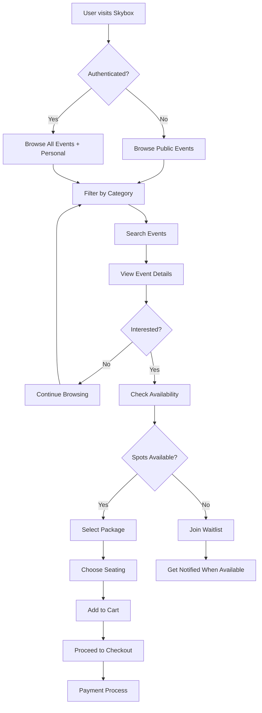

### **2. Event Booking & Payment Flow**
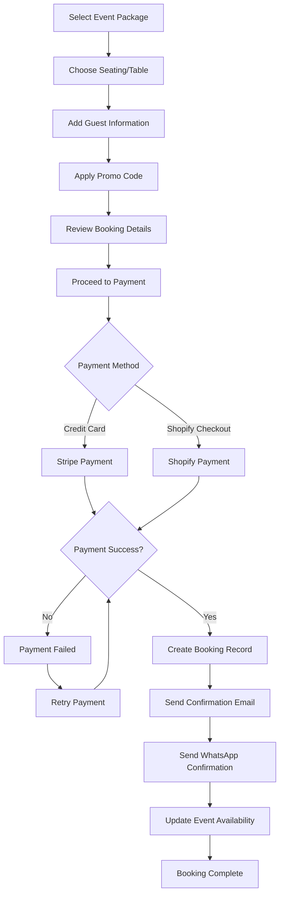

### **3. Event Management (Staff) Flow**
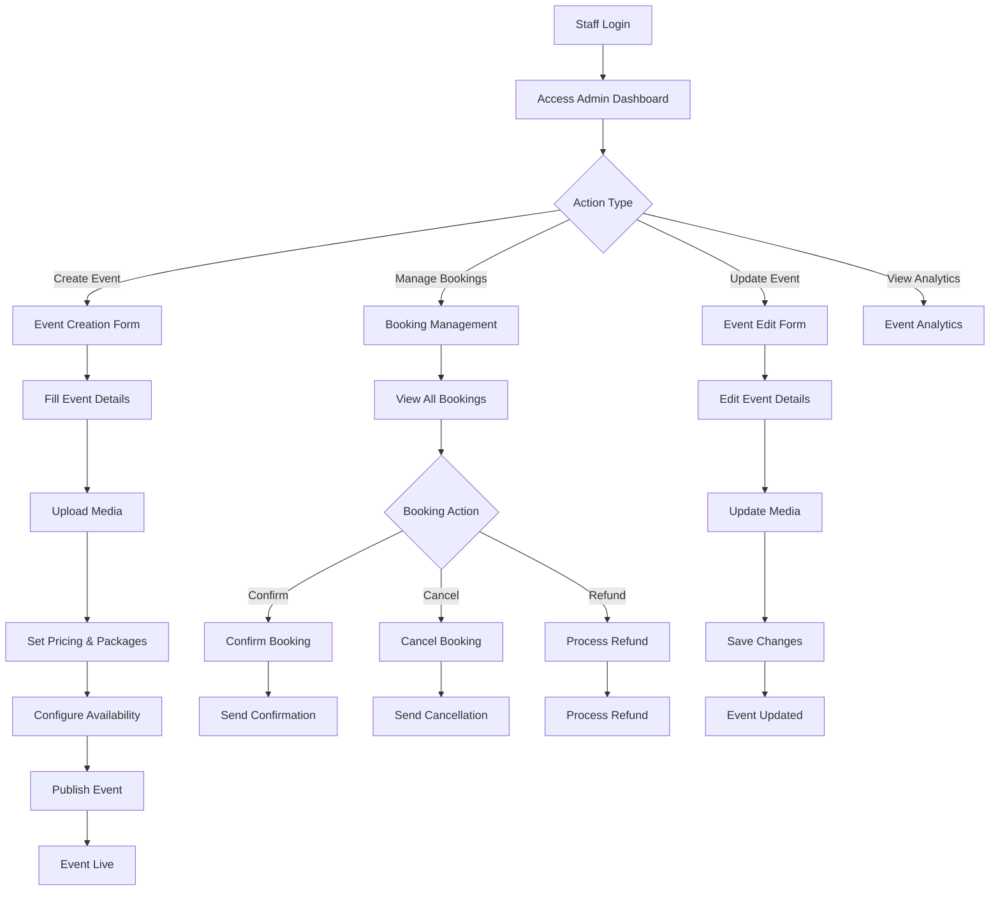

---

## **🔧 SYSTEM PROCESS FLOWS**

### **4. Database Schema Creation Flow**
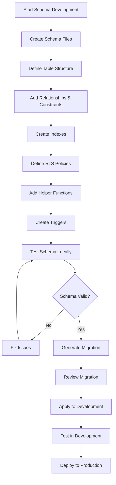

### **5. Shopify Integration Flow**
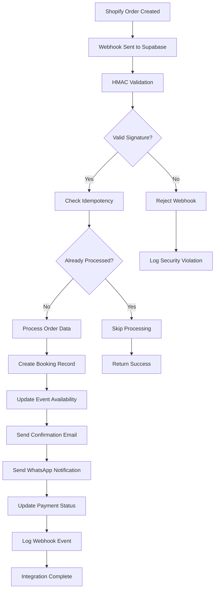

### **6. WhatsApp Notification Flow**
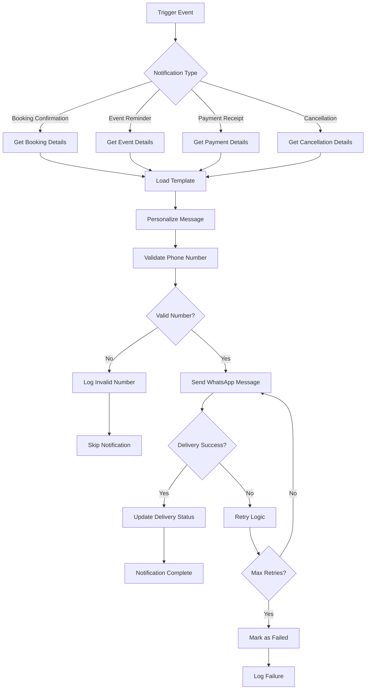

---

## **🔄 DATA FLOW DIAGRAMS**

### **7. Event Data Flow**
```mermaid
flowchart LR
    A[Event Creation] --> B[Database Storage]
    B --> C[RLS Policy Check]
    C --> D[Data Validation]
    D --> E[Index Update]
    E --> F[Cache Update]
    F --> G[Frontend Display]
    G --> H[User Interaction]
    H --> I[Booking Request]
    I --> J[Availability Check]
    J --> K[Booking Creation]
    K --> L[Payment Processing]
    L --> M[Confirmation Flow]
```

### **8. Payment Processing Flow**
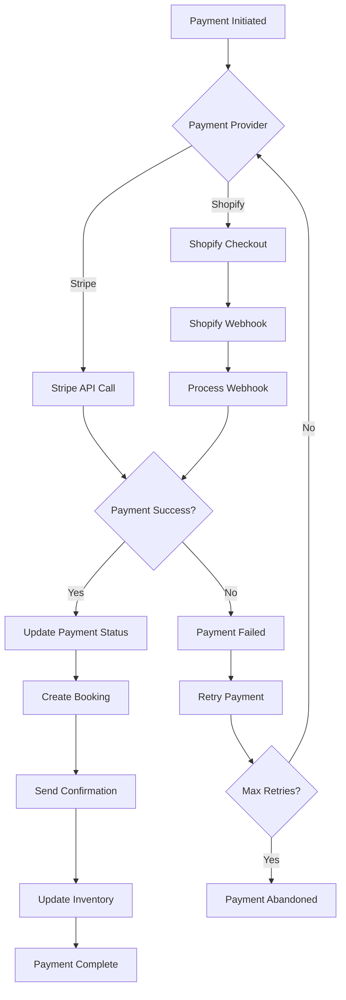

---

## **📱 MOBILE & RESPONSIVE FLOWS**

### **9. Mobile Event Discovery**
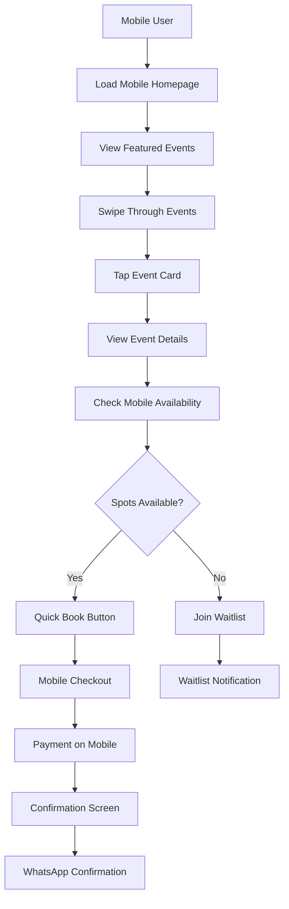

### **10. Admin Mobile Management**
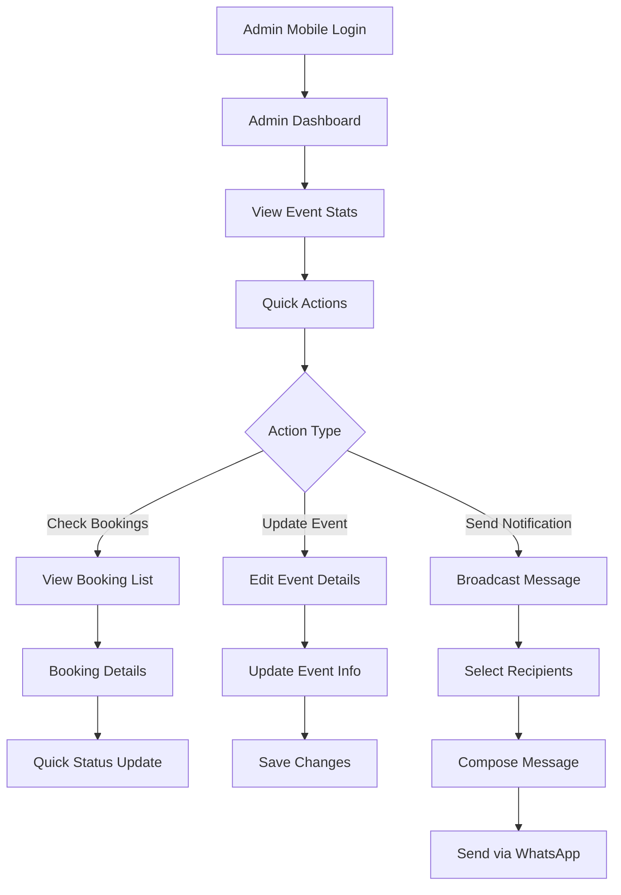

---

## **🔐 SECURITY & AUTHENTICATION FLOWS**

### **11. User Authentication Flow**
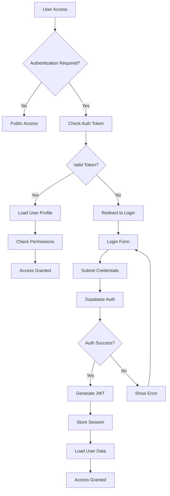

### **12. RLS Policy Enforcement Flow**
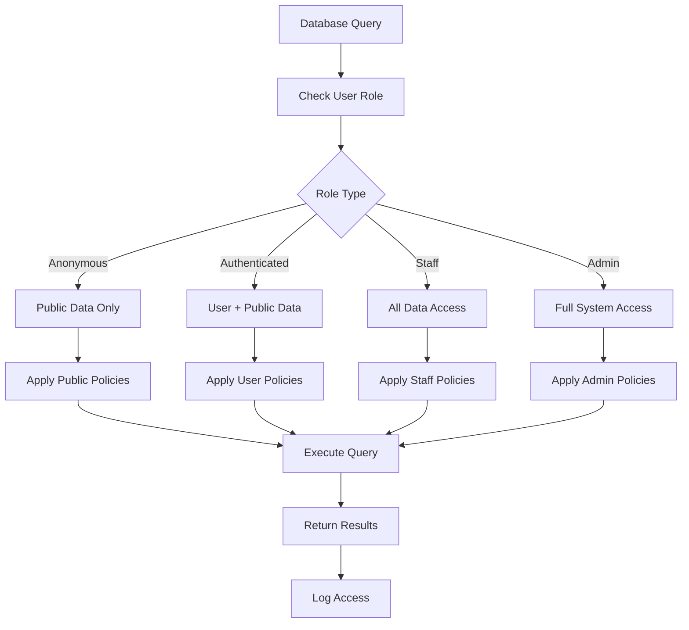

---

## **📊 ANALYTICS & MONITORING FLOWS**

### **13. Event Analytics Flow**
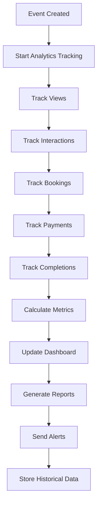

### **14. System Health Monitoring**
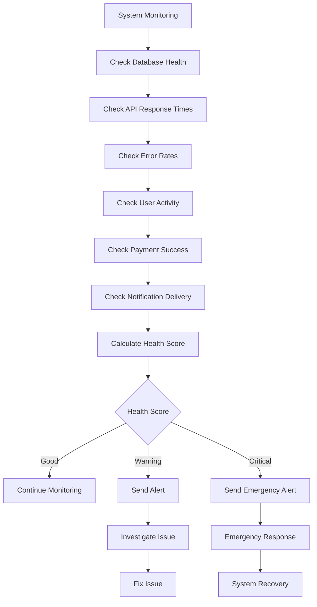

---

## **🎯 KEY INTEGRATION POINTS**

### **15. External Service Integration**
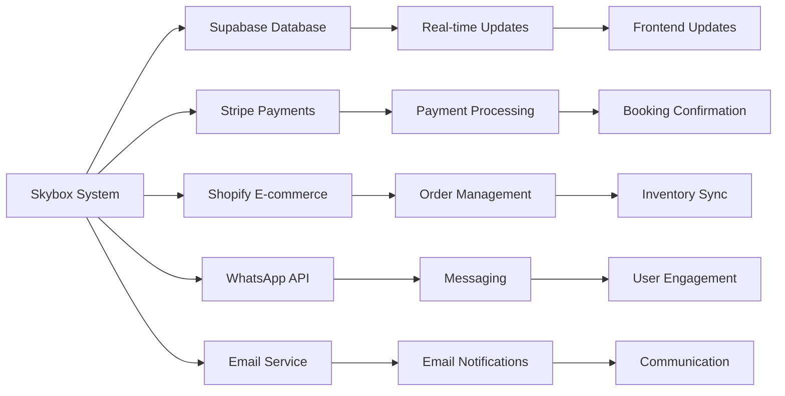

---

## **📋 FLOW SUMMARY**

### **User-Facing Flows**
1. **Event Discovery** - Browse, search, filter events
2. **Booking Process** - Select, pay, confirm bookings
3. **Mobile Experience** - Optimized mobile flows
4. **Authentication** - Secure user access

### **System Flows**
5. **Database Operations** - Schema creation and management
6. **Payment Processing** - Multi-provider payment handling
7. **Notification System** - WhatsApp and email automation
8. **Admin Management** - Staff event and booking management

### **Integration Flows**
9. **Shopify Integration** - E-commerce synchronization
10. **WhatsApp Automation** - User communication
11. **Analytics Tracking** - Performance monitoring
12. **Security Enforcement** - RLS and authentication

---

**Last Updated:** October 24, 2025  
**Version:** 1.0 - Event System Flow Diagrams