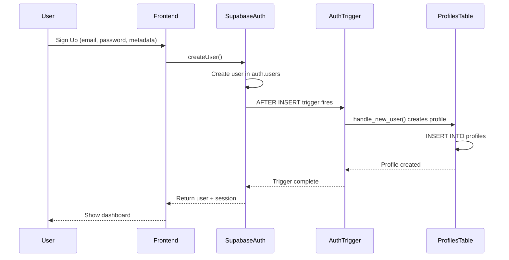
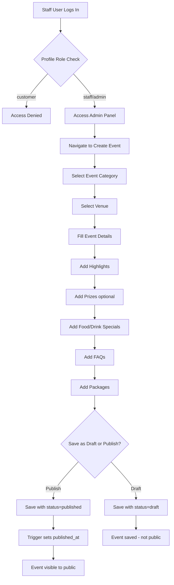
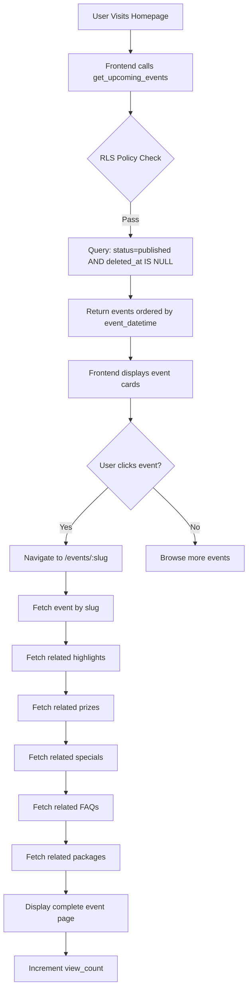
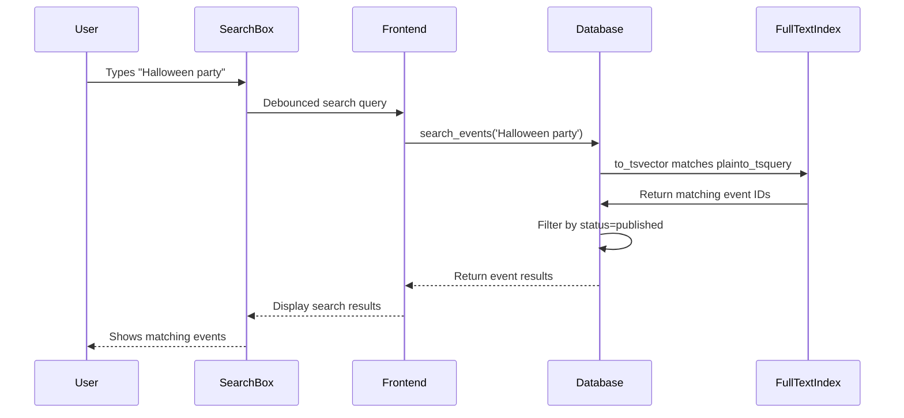
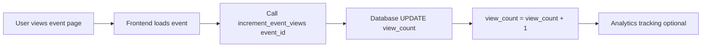
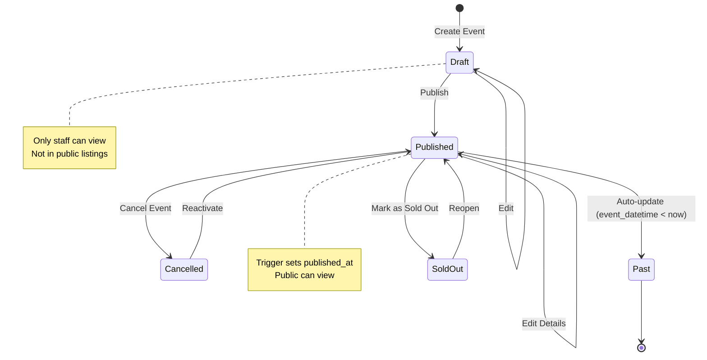
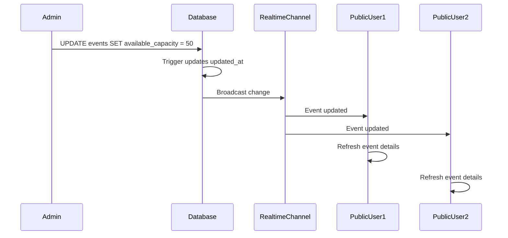
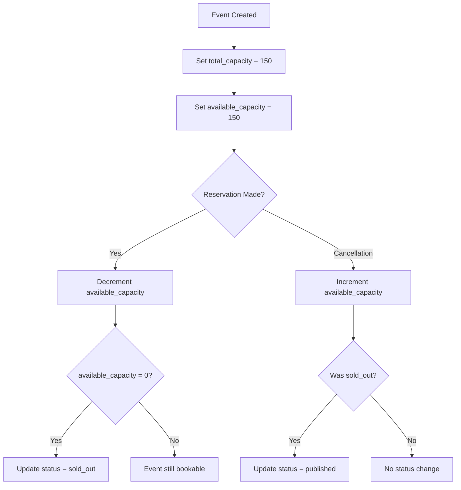
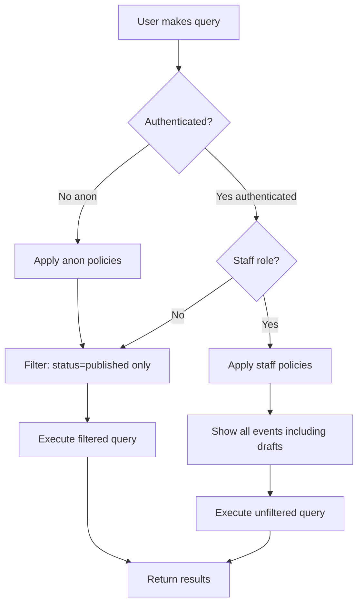

# Skybox GameHub - Data Flow Diagrams

## Overview

This document contains data flow diagrams showing how data moves through the Skybox GameHub system for key user journeys and system processes.

---

## 1. User Authentication & Profile Creation Flow



### Key Points
- Automatic profile creation via database trigger
- User metadata (full_name, phone) extracted from signup
- Default role is 'customer'
- No manual profile creation needed

---

## 2. Event Creation Flow (Staff)



### Database Operations
1. INSERT into `events` table
2. INSERT multiple rows into `event_highlights`
3. INSERT multiple rows into `event_prizes` (if applicable)
4. INSERT multiple rows into `event_specials`
5. INSERT multiple rows into `event_faqs`
6. INSERT multiple rows into `event_packages`
7. TRIGGER updates `published_at` if status = 'published'

---

## 3. Public Event Discovery Flow



### RLS Policy Applied
```sql
-- Only published, non-deleted events visible
WHERE status = 'published' AND deleted_at IS NULL
```

---

## 4. Event Search Flow



### Full-Text Search Implementation
```sql
CREATE INDEX idx_events_search ON events
USING gin(to_tsvector('english', title || ' ' || description || ' ' || subtitle));

-- Search function
SELECT * FROM events
WHERE to_tsvector('english', title || ' ' || description)
@@ plainto_tsquery('english', 'Halloween party')
AND status = 'published'
AND deleted_at IS NULL;
```

---

## 5. Event View Tracking Flow



### SQL Operation
```sql
UPDATE events
SET view_count = view_count + 1
WHERE id = :event_id;
```

---

## 6. Staff Event Management Flow



### Status Transitions
- **draft** → **published**: Trigger sets `published_at = now()`
- **published** → **cancelled**: Event hidden from public
- **published** → **sold_out**: Event visible but booking disabled
- **published** → **past**: Automatic based on `event_datetime`

---

## 7. Real-Time Event Updates Flow



### Frontend Subscription (Future)
```typescript
const channel = supabase
  .channel('events-changes')
  .on('postgres_changes',
    { event: 'UPDATE', schema: 'public', table: 'events' },
    (payload) => {
      console.log('Event updated:', payload.new)
      // Refresh event in UI
    }
  )
  .subscribe()
```

---

## 8. Capacity Management Flow



### Trigger Logic (Future Implementation)
```sql
CREATE FUNCTION update_event_capacity()
RETURNS TRIGGER AS $$
BEGIN
  UPDATE events
  SET available_capacity = available_capacity - 1,
      status = CASE
        WHEN available_capacity - 1 = 0 THEN 'sold_out'
        ELSE status
      END
  WHERE id = NEW.event_id;
  RETURN NEW;
END;
$$ LANGUAGE plpgsql;
```

---

## 9. Multi-Table Query Flow (Event Detail Page)

```mermaid
flowchart LR
    A[GET /api/events/:slug] --> B[SELECT FROM events WHERE slug]
    B --> C[SELECT FROM event_highlights WHERE event_id]
    C --> D[SELECT FROM event_prizes WHERE event_id]
    D --> E[SELECT FROM event_specials WHERE event_id]
    E --> F[SELECT FROM event_faqs WHERE event_id]
    F --> G[SELECT FROM event_packages WHERE event_id]
    G --> H[Combine all data into response]
    H --> I[Return JSON to frontend]
```



### Optimized Query with JOINs
```sql
SELECT
  e.*,
  json_agg(DISTINCT h.*) FILTER (WHERE h.id IS NOT NULL) as highlights,
  json_agg(DISTINCT p.*) FILTER (WHERE p.id IS NOT NULL) as prizes,
  json_agg(DISTINCT s.*) FILTER (WHERE s.id IS NOT NULL) as specials,
  json_agg(DISTINCT f.*) FILTER (WHERE f.id IS NOT NULL) as faqs,
  json_agg(DISTINCT pk.*) FILTER (WHERE pk.id IS NOT NULL) as packages
FROM events e
LEFT JOIN event_highlights h ON h.event_id = e.id
LEFT JOIN event_prizes p ON p.event_id = e.id
LEFT JOIN event_specials s ON s.event_id = e.id
LEFT JOIN event_faqs f ON f.event_id = e.id
LEFT JOIN event_packages pk ON pk.event_id = e.id
WHERE e.slug = :slug
GROUP BY e.id;
```

---

## 10. RLS Policy Evaluation Flow



### RLS Policy Example
```sql
-- Public sees only published events
CREATE POLICY "Published events readable by all"
ON events FOR SELECT TO authenticated, anon
USING (status = 'published' AND deleted_at IS NULL);

-- Staff sees all events
CREATE POLICY "All events readable by staff"
ON events FOR SELECT TO authenticated
USING (is_staff());
```

---

## Data Flow Summary

### High-Traffic Flows
1. **Event Discovery** (public, high volume)
   - Optimized with indexes on `event_datetime`, `status`, `is_featured`
   - Full-text search index for search queries

2. **Event Detail Page** (public, high volume)
   - Single query with JOINs or multiple optimized queries
   - Increment view_count asynchronously

### Low-Traffic Flows
3. **Event Creation** (staff only, low volume)
   - Multiple INSERT operations
   - No performance concerns

4. **Profile Creation** (triggered, low volume)
   - Automatic via trigger
   - Happens once per user

---

**Last Updated**: 2025-10-24
**Version**: 1.0
**Related**: ERD_DIAGRAM.md
