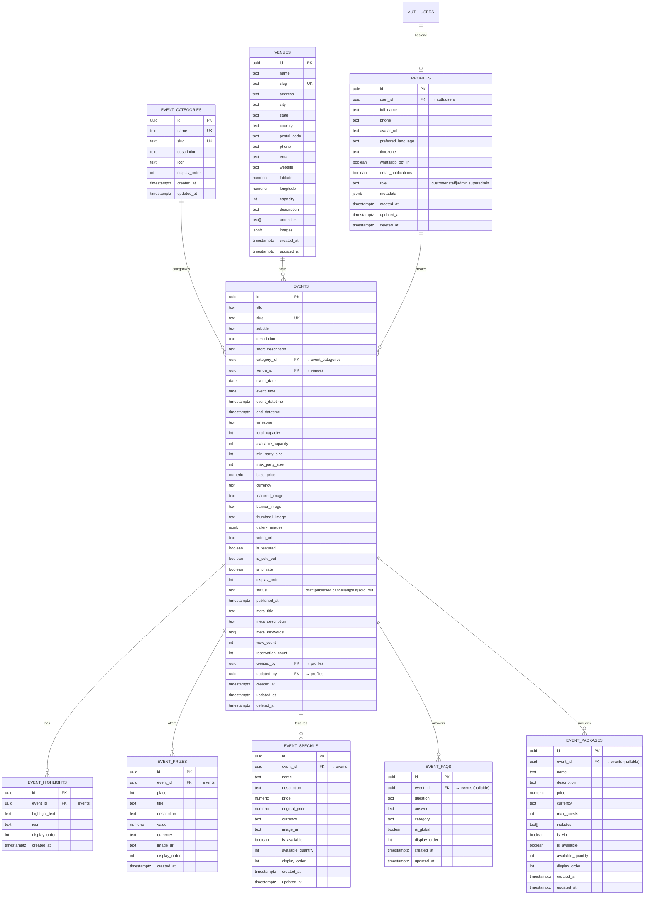

# Skybox GameHub - Entity Relationship Diagram (ERD)

## Overview

This ERD shows all tables in the Skybox GameHub database schema, their relationships, and key fields.

## Mermaid Diagram

## Table Relationships

### 1:1 Relationships
- `auth.users` ↔ `profiles`: Each authenticated user has exactly one profile

### 1:N Relationships
- `event_categories` → `events`: One category can have many events
- `venues` → `events`: One venue can host many events
- `profiles` → `events`: One user can create many events (created_by, updated_by)
- `events` → `event_highlights`: One event can have multiple highlights
- `events` → `event_prizes`: One event can have multiple prizes
- `events` → `event_specials`: One event can have multiple food/drink specials
- `events` → `event_faqs`: One event can have multiple FAQs
- `events` → `event_packages`: One event can have multiple packages

## Key Constraints

### Primary Keys
All tables use `uuid` primary keys with `gen_random_uuid()` default

### Unique Constraints
- `profiles.user_id` - Ensures one profile per user
- `event_categories.name` - Category names must be unique
- `event_categories.slug` - Category slugs must be unique
- `venues.slug` - Venue slugs must be unique
- `events.slug` - Event slugs must be unique (for URL routing)

### Foreign Key Actions
- **profiles → auth.users**: `ON DELETE CASCADE` (delete profile if user deleted)
- **events → event_categories**: `ON DELETE SET NULL` (preserve event if category deleted)
- **events → venues**: `ON DELETE SET NULL` (preserve event if venue deleted)
- **events → profiles** (created_by/updated_by): `ON DELETE SET NULL`
- **event_highlights → events**: `ON DELETE CASCADE` (delete highlights if event deleted)
- **event_prizes → events**: `ON DELETE CASCADE`
- **event_specials → events**: `ON DELETE CASCADE`
- **event_faqs → events**: `ON DELETE CASCADE`
- **event_packages → events**: `ON DELETE CASCADE`

## Indexes

### Performance Indexes
- `idx_profiles_user_id` on `profiles(user_id)`
- `idx_profiles_role` on `profiles(role)` WHERE deleted_at IS NULL
- `idx_event_categories_slug` on `event_categories(slug)`
- `idx_venues_slug` on `venues(slug)`
- `idx_events_slug` on `events(slug)`
- `idx_events_category` on `events(category_id)`
- `idx_events_venue` on `events(venue_id)`
- `idx_events_datetime` on `events(event_datetime DESC)`
- `idx_events_status` on `events(status)`
- `idx_events_featured` on `events(is_featured)` WHERE is_featured = true
- `idx_events_published` on `events(published_at DESC)` WHERE status = 'published'

### Full-Text Search Index
- `idx_events_search` on `events` using GIN for full-text search on title, description, subtitle

## Security (RLS Policies)

### Public Read Access
- `event_categories`: All users can read
- `venues`: All users can read
- `events`: Only published, non-deleted events visible to public
- `event_highlights`, `event_prizes`, `event_specials`, `event_faqs`, `event_packages`: Visible if parent event is published

### Authenticated User Access
- `profiles`: Users can read all profiles, update own profile
- `events`: Staff can see all events (including drafts)

### Staff/Admin Access
- `event_categories`: Staff can create/update/delete
- `venues`: Staff can create/update/delete
- `events`: Staff can create/update, Admins can delete
- All event-related tables: Staff can manage

## Data Flow

### Event Creation Flow
1. Staff user creates profile (auto-created via trigger)
2. Staff creates event category (if new)
3. Staff creates/selects venue
4. Staff creates event record
5. Staff adds highlights, prizes, specials, FAQs, packages
6. Staff publishes event (status → 'published')
7. Trigger sets `published_at` timestamp
8. Public can now view event

### User Registration Flow
1. User signs up via Supabase Auth → creates record in `auth.users`
2. Trigger `on_auth_user_created` fires
3. Function `handle_new_user()` creates profile in `public.profiles`
4. User can now make reservations (future feature)

## Future Extensions

Tables not yet implemented but planned:

- `reservations`: Customer table reservations
- `reservation_items`: Packages/specials selected per reservation
- `menu_categories`: Food & drink categories
- `menu_items`: Menu items
- `gallery_images`: Gallery for venue/events
- `whatsapp_messages`: WhatsApp automation log
- `shopify_orders`: E-commerce integration
- `analytics_events`: User behavior tracking

---

**Last Updated**: 2025-10-24
**Version**: 1.0
**Schema Files**: `/home/sk/skybox-gamehub/supabase/schemas/`
